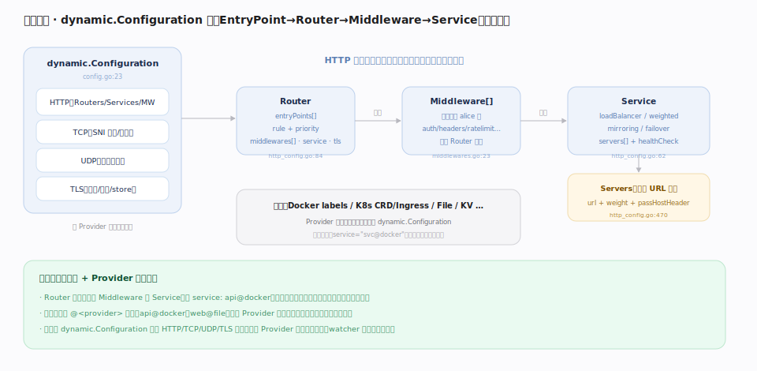

# Traefik 核心原理 · 接触面主线 · 动态配置

> **定位**：接触面主线之一，也是 Traefik 的**接触面本体**——用户真正声明「怎么路由、怎么加工、发往哪」的地方。动态配置以 `dynamic.Configuration`（`pkg/config/dynamic/config.go:23`）为载体，由 **Provider 从外部世界发现并产出**，经**热加载**通道生效，**无需重启**。它组织成 **EntryPoint → Router → Middleware → Service** 的引用模型。与静态配置的分工：静态立骨架（端口/启用项），动态填血肉（路由/中间件/后端），且血肉可随时热更。核实基准：本地源码 `traefik/v3`。

## 一、dynamic.Configuration：HTTP/TCP/UDP/TLS 四面

一份 `dynamic.Configuration`（`config.go:23`）覆盖四个面：**HTTP**（`Routers`/`Services`/`Middlewares`，`http_config.go:38`）、**TCP**（SNI 路由与服务，`tcp_config.go:15`）、**UDP**（会话服务，`udp_config.go:10`）、**TLS**（证书、选项、store）。HTTP 面最丰富，是理解一切的核心：Router 承接匹配、Middleware 承接加工、Service 承接转发。

## 二、引用模型：Router → Middleware[] → Service → Servers

四段是**名称引用**关系：`Router`（`http_config.go:84`）声明 `entryPoints[]`、`rule`+`priority`、要挂的 `middlewares[]`、目标 `service`、可选 `tls`；`Middleware`（`middlewares.go:23`）按序组成 alice 链；`Service`（`http_config.go:62`）持有 `loadBalancer`/`weighted`/`mirroring`/`failover` 之一，最终指向 `Servers`（后端 URL 池，`http_config.go:470`）。**每个对象带 `@<provider>` 后缀**（如 `api@docker`、`web@file`），跨 Provider 引用需带后缀，天然隔离命名冲突。运行期把这份名称引用配置解析成一张可执行的对象图。

## 深化 · Service 的四种形态

| 形态 | 语义 | 源码 |
|---|---|---|
| `loadBalancer` | 一组真实后端 Server 的负载均衡（wrr/p2c/hrw/leasttime） | `http_config.go:383` |
| `weighted`（WRR） | 对**多个 Service**加权轮询（服务级组合，非 server 级） | `http_config.go:252` |
| `mirroring` | 主 Service + 按百分比镜像流量到其它 Service | `http_config.go:202` |
| `failover` | 主 Service 挂了自动切 fallback | `http_config.go:221` |

## 调优要点

- **rule 尽量具体**：默认 `priority=len(rule)`，写 `Host(...) && PathPrefix(...)` 比裸 `PathPrefix(...)` 更长、天然优先。
- **中间件复用**：把 `auth`/`headers`/`ratelimit` 定义一次，多个 Router 用名字引用，避免复制粘贴。
- **服务级组合用 `weighted`**：灰度/金丝雀发布用 `weighted` 在两个 Service 间按权重切；`mirroring` 做无副作用的影子流量验证。
- **跨 Provider 引用记得带 `@`**：`service: api@docker` 才能从 File Provider 的 Router 引到 Docker Provider 的 Service。

## 常见误区

- **混淆 `weighted` 与 `loadBalancer`**：前者在 **Service 之间**加权（组合），后者在 **Server 之间**均衡（真实后端）。
- **以为动态配置只能来自 File**：动态配置的常态是 Docker labels、K8s CRD/Ingress、Consul/Etcd KV 等**自动发现**；File 只是其中一种便于手写的来源。
- **忘记 `@provider` 后缀导致引用失败**：不带后缀默认在当前 Provider 命名空间找，跨 Provider 会找不到。
- **改动态配置去重启进程**：完全不必——Provider 一变，watcher 去重合并后热替换，秒级生效、连接不断。

## 一句话总纲

**动态配置是 Traefik 真正的接触面：一份 `dynamic.Configuration` 用「Router→Middleware→Service→Servers」名称引用模型描述路由，由 Provider 从外部世界发现产出、热加载生效——填的是可随时更换的血肉。**
