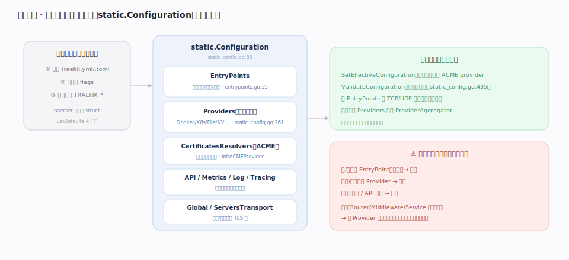

# Traefik 核心原理 · 接触面主线 · 静态配置

> **定位**：接触面主线之一——用户通过 `traefik.yml`/CLI/环境变量声明 Traefik 的**启动期固化行为**：监听哪些端口（EntryPoints）、启用哪些配置源（Providers）、全局的日志/API/证书解析器/可观测开关。它在进程启动时被解码进 `static.Configuration`（`pkg/config/static/static_config.go:86`）并**一次性固化**，运行期不再改动——这与另一条接触面「动态配置」形成 Traefik 最核心的**静态/动态分水岭**。核实基准：本地源码 `traefik/v3`。

## 一、结构：三类来源汇入 static.Configuration

静态配置有**三类同源来源**——配置文件（`traefik.yml`/`.toml`）、命令行 flag、环境变量 `TRAEFIK_*`——由 paerser 统一解码进同一个 `static.Configuration` 结构体（`static_config.go:86`）。关键字段：**EntryPoints**（监听地址/端口/协议，`entrypoints.go:25`）、**Providers**（启用哪些配置源，`static_config.go:261`）、**CertificatesResolvers**（ACME 证书解析器定义）、以及 **API/Metrics/Log/Tracing/Global** 等全局项。启动时先 `SetEffectiveConfiguration`（补默认、派生 ACME provider，`static_config.go:293`）再 `ValidateConfiguration`（`static_config.go:435`）。

## 二、启动装配与「改需重启」的分水岭

静态配置只在启动期跑一次装配：按 EntryPoints 绑定 TCP/UDP 监听器、按启用的 Providers 组装 `ProviderAggregator`。之后进入运行期，这些项**不再变**。因此**加/删端口、启用/停用 Provider、改日志级别都需要重启进程**。这正是与 nginx 的差异所在：nginx 连路由（`server`/`location`）都写在静态文件里，靠 reload 生效；Traefik 把**易变的路由/中间件/后端剥离成动态配置**交给 Provider，只把**稳定的骨架（端口、启用项）**留在静态配置。

## 深化 · 静态项与动态项的边界

| 归属 | 典型内容 | 变更方式 | 源码锚点 |
|---|---|---|---|
| **静态** | EntryPoints（端口/协议） | 重启进程 | `entrypoints.go:25` |
| **静态** | 启用哪些 Provider | 重启进程 | `static_config.go:261` |
| **静态** | CertificatesResolvers/ACME 账户 | 重启进程 | `static_config.go:133` |
| **静态** | API/Dashboard、全局日志级别、全局 Metrics/Tracing | 重启进程 | `static_config.go:86` |
| **动态** | Routers / Middlewares / Services / TLS 证书与选项 | Provider 热加载，秒级生效 | `dynamic/config.go:23` |

## 调优要点

- **一次规划好静态骨架**：把端口、启用的 Provider、观测开关在部署时定好，运行期靠动态 Provider 变更路由/后端，避免重启抖动。
- **`asDefault` 简化 Router**：给常用 EntryPoint 设 `asDefault: true`，未显式声明 entryPoints 的 Router 自动落到它上面（`entrypoints.go:28`）。
- **`entrypoints.<ep>.http.middlewares` / `.tls`** 把默认中间件与默认 TLS 挂在入口，减少每个 Router 的重复。
- **多来源合并有优先级**：CLI/env 覆盖文件；用它在容器镜像默认值之上做环境差异化，而非维护多份配置文件。

## 常见误区

- **把 Router 写进静态配置**：Router/Middleware/Service 属**动态**配置，即使用 File Provider 也是「动态」的（File Provider 会 watch 文件热加载），不要与 `traefik.yml` 里的静态段混为一谈。
- **以为环境变量不能配复杂结构**：`TRAEFIK_*` 能表达嵌套结构（用 `_` 分层），完整覆盖静态配置。
- **改了 `traefik.yml` 的动态段却不生效**：静态配置文件只解析静态项；动态配置要通过 File Provider 指向的**独立动态配置文件/目录**，或其他 Provider 提供。

## 一句话总纲

**静态配置是 Traefik 的启动骨架——端口、启用的 Provider、全局开关一次固化、改需重启；它刻意只保留"稳定的少数"，把"易变的多数"交给动态配置与 Provider 热加载。**
