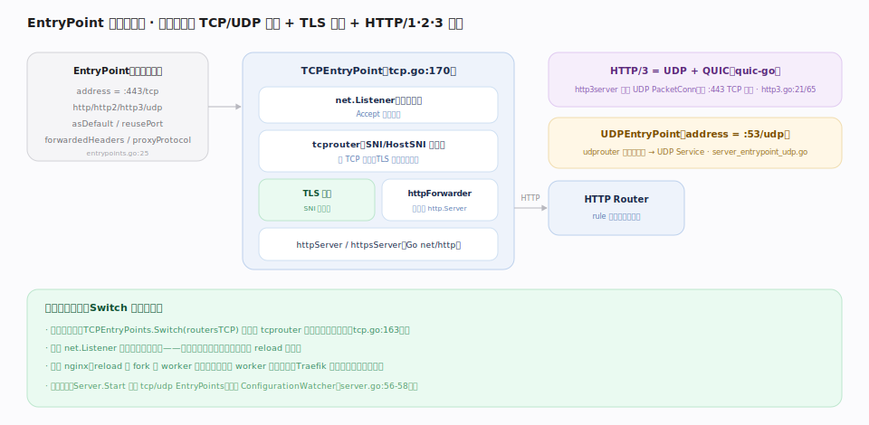

# Traefik 核心原理 · 支撑能力域 · EntryPoint 监听与协议

> **定位**：数据面的**入口能力域**。EntryPoint 是 Traefik 对外的监听单元——一个端口 + 协议（TCP/UDP）+ 可选 TLS 终止 + HTTP/1·2·3 分流。它在静态配置里定义（`pkg/config/static/entrypoints.go:25`），启动时绑定 `net.Listener`；运行期只**热替换内部路由表**，端口与已建连接不动。它承接客户端连接、终止 TLS，再把 HTTP 请求交给 Router。核实基准：本地源码 `traefik/v3`。

## 一、一个端口的完整监听栈

EntryPoint 静态定义 `address = :443/tcp`（`GetProtocol` 缺省 tcp，`entrypoints.go`）、可选 `http/http2/http3/udp` 子配置、`asDefault`/`reusePort`/`forwardedHeaders`/`proxyProtocol`（`entrypoints.go:25`）。启动时 `TCPEntryPoint`（`server_entrypoint_tcp.go:170`）绑 `net.Listener` 并进 Accept 循环；连接先过 **tcprouter** 做 SNI/HostSNI 分流决定"TLS 终止还是 TCP 直通"；需终止 TLS 时按 SNI 选证书，再经 **httpForwarder**（`server_entrypoint_tcp.go:68`）桥接到 Go 标准 `http.Server`（`httpServer`/`httpsServer`），最后交给 HTTP Router。**HTTP/3** 由独立的 `http3server`（`server_entrypoint_tcp_http3.go:21`，基于 `quic-go/quic-go/http3`）在同端口的 UDP PacketConn 上并行提供；**UDP EntryPoint**（`server_entrypoint_udp.go`）则按会话分流到 UDP Service。

## 二、热替换：Switch 换路由表而非重开监听

配置变更时，`TCPEntryPoints.Switch(routersTCP)`（`server_entrypoint_tcp.go:163`）只**替换 tcprouter 内部的路由表指针**，底层 `net.Listener` 与已建立连接不动——端口不重开、连接不中断、无 reload 停顿。这是与 nginx 的又一分水岭：nginx reload 要 fork 新 worker 接管新连接、旧 worker 优雅退出；Traefik 只换内存里的路由表。启动顺序上，`Server.Start` 先起 TCP/UDP EntryPoints 再起 ConfigurationWatcher（`server.go:56-58`），保证监听就绪后才应用配置。

## 深化 · EntryPoint 关键选项

| 选项 | 作用 | 源码 |
|---|---|---|
| `address` | `host:port/proto`，proto 缺省 tcp | `entrypoints.go` `GetProtocol` |
| `asDefault` | 未声明 entryPoints 的 Router 落到此入口 | `entrypoints.go:28` |
| `reusePort` | 多进程/实例共享同端口（SO_REUSEPORT） | `entrypoints.go:27` |
| `http.redirections` | 入口级重定向（如 :80→:443） | `entrypoints.go` HTTPConfig |
| `http.tls` / `http.middlewares` | 入口级默认 TLS / 默认中间件 | `entrypoints.go` HTTPConfig |
| `http3` | 在同端口开 QUIC/HTTP3（UDP） | `server_entrypoint_tcp_http3.go` |
| `forwardedHeaders` / `proxyProtocol` | 信任上游转发头 / 解析 PROXY 协议 | `entrypoints.go:25` |

## 调优要点

- **:80→:443 重定向**用入口级 `http.redirections`，比每个 Router 写重定向中间件干净。
- **开 HTTP/3** 需同时放通 UDP :443 并设 `http3`；客户端经 `Alt-Svc` 升级。
- **`reusePort`** 让多个 Traefik 进程/实例监听同端口，配合滚动升级实现零停机。
- **入口默认中间件/TLS** 抽到 EntryPoint，避免每个 Router 重复；但注意它对该入口所有 Router 生效。

## 常见误区

- **把 EntryPoint 当路由**：它只管"在哪个端口用什么协议收连接 + 是否终止 TLS"，具体走哪条路由由 Router 的 rule 决定。
- **以为改 Router 会重开端口**：只热替换路由表，监听与连接不动。
- **HTTP/3 只配 `http3` 却没放通 UDP**：QUIC 走 UDP，防火墙/安全组需放行对应 UDP 端口。
- **混淆入口级 TLS 与 Router 级 TLS**：入口级是默认兜底，Router 的 `tls` 更具体、可覆盖（含 certResolver/域名）。

## 一句话总纲

**EntryPoint 是 Traefik 的监听入口：一个端口上完成 TCP/UDP 监听、TLS 终止与 HTTP/1·2·3 分流，再交给 Router；配置变更时只用 Switch 热替换内存路由表，端口与连接岿然不动。**
