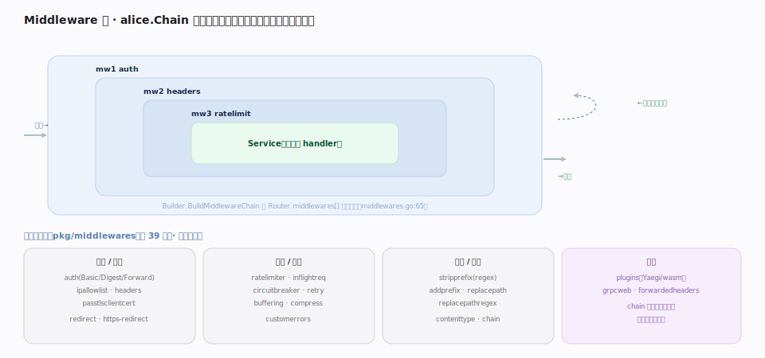

# Traefik 核心原理 · 支撑能力域 · Middleware 中间件链

> **定位**：数据面的**加工能力域**。Middleware 在 Router 命中后、请求到达 Service 前，对请求/响应做拦截与改写——认证、限流、重试、熔断、路径改写、加压缩、加头等。多个中间件按 Router 的 `middlewares[]` 顺序组成 **alice.Chain 洋葱链**（`pkg/server/middleware/middlewares.go:65`）。中间件定义在动态配置里（`pkg/config/dynamic/middlewares.go:23`），可跨 Router 复用。核实基准：本地源码 `traefik/v3`。

## 一、洋葱链：请求进层层加工，响应出层层回卷

`Builder.BuildMiddlewareChain(ctx, middlewares)`（`middlewares.go:65`）按 Router 声明的顺序，用 `justinas/alice` 的 `Chain` 把中间件**逐层包裹**成一个 `http.Handler`，最内层是 Service。请求从外向内穿过每层（auth→headers→ratelimit→…→Service），响应再从内向外**层层回卷**——这是标准的洋葱模型：每个中间件都能在"调用下一层之前"和"之后"两处插手（如 accesslog 记开始时间、compress 压缩返回体）。`buildConstructor`（`middlewares.go:101`）按中间件类型实例化对应构造器。

## 二、中间件目录：39 类按职责分组

`pkg/middlewares` 下有 **39 个中间件目录**，按职责分四组：**认证/安全**（auth 的 Basic/Digest/Forward、ipallowlist、headers、passtlsclientcert、redirect）、**流量/韧性**（ratelimiter、inflightreq、circuitbreaker、retry、buffering、compress、customerrors）、**路径/改写**（stripprefix(regex)、addprefix、replacepath(regex)、contenttype、chain）、**扩展**（plugins 走 Yaegi 解释/wasm、grpcweb、forwardedheaders）。特殊的 `chain` 中间件能把多个中间件**打包成一个**，便于整体复用。

## 深化 · 高频中间件语义

| 中间件 | 作用 | 常见用途 |
|---|---|---|
| `stripPrefix` | 转发前剥掉路径前缀 | `/api/users` → 后端收到 `/users` |
| `headers` | 增删请求/响应头、CORS、HSTS | 安全头注入 |
| `ratelimiter` | 令牌桶限流（平均/突发） | 防刷 |
| `circuitBreaker` | 表达式触发熔断 | 后端异常快速失败 |
| `retry` | 幂等重试若干次 | 抖动容错 |
| `basicAuth`/`forwardAuth` | 内建认证 / 委托外部鉴权服务 | 访问控制 |
| `redirectScheme` | http→https 跳转 | 强制 TLS |
| `chain` | 组合多个中间件为一 | 复用策略包 |

## 调优要点

- **顺序即语义**：`middlewares[]` 的顺序决定包裹层次，认证/限流应靠外（先拦），路径改写靠内（贴近 Service）。
- **用 `chain` 打包策略**：把"安全头 + 限流 + 认证"打成一个 chain，多 Router 引用一处维护。
- **`forwardAuth` 委托鉴权**：把复杂鉴权逻辑交给外部服务，Traefik 只按返回状态放行/拒绝。
- **`retry` 只对幂等请求开**：非幂等请求重试可能造成重复副作用。

## 常见误区

- **以为中间件能改路由目标**：中间件加工请求/响应，不改"发往哪个 Service"——那是 Router+Service 的职责。
- **顺序无所谓**：错。限流放在认证之后可能已浪费鉴权开销；改写放在认证之前可能绕过路径级鉴权。
- **`stripPrefix` 与 `PathPrefix` 混为一谈**：前者是中间件（改写转发路径），后者是匹配器（决定是否命中）。
- **插件当原生一样零开销**：Yaegi 解释执行有额外成本，热点路径慎用重插件。

## 一句话总纲

**Middleware 是数据面的洋葱链：按 Router 声明顺序用 alice.Chain 层层包裹，请求进时逐层加工、响应出时逐层回卷；39 类覆盖认证/限流/韧性/改写/扩展，且可跨 Router 复用。**
