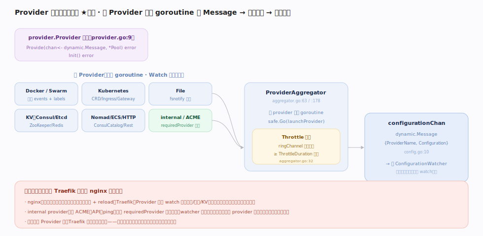
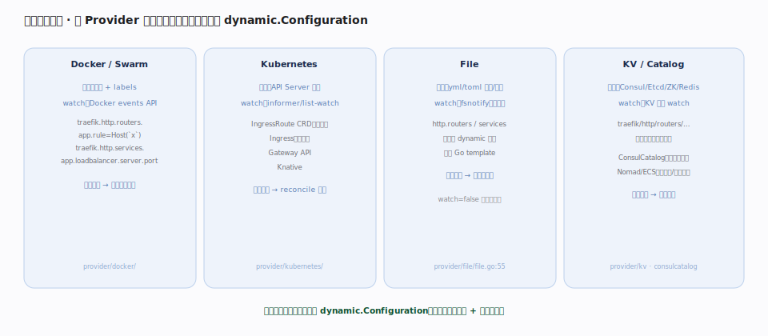

# Traefik 核心原理 · 支撑能力域 · Provider 动态配置发现与聚合 ★灵魂

> **定位**：**灵魂能力域**。Provider 是 Traefik 一切动态配置的产出源，也是它区别于 nginx 的分水岭——nginx 靠人工改文件 + reload，Traefik 靠 Provider **主动 watch 外部世界**（Docker/K8s/文件/KV/云平台）并把真实状态翻译成 `dynamic.Configuration`。所有 Provider 实现同一个接口 `provider.Provider`（`pkg/provider/provider.go:9`），由 `ProviderAggregator` 聚合、去抖后汇入配置通道（`pkg/provider/aggregator/aggregator.go`）。核实基准：本地源码 `traefik/v3`。

## 一、聚合管线：Provider → Aggregator → 去抖 → 配置通道

`provider.Provider` 接口只有两个方法：`Provide(chan<- dynamic.Message, *safe.Pool) error` 和 `Init`（`provider.go:9`）。`ProviderAggregator`（`aggregator.go:63`）在 `Provide` 里为**每个 Provider 起一个 goroutine**（`safe.Go(launchProvider)`，`aggregator.go:178`），各自 watch 自己的真源、把 `dynamic.Message{ProviderName, Configuration}`（`config.go:10`）推入共享 `configurationChan`。为避免抖动，聚合层给每个 Provider 套一层 **throttle**：`maybeThrottledProvide`（`aggregator.go:32`）用 `ringChannel` 合并突发，保证两次事件间隔 ≥ `ThrottleDuration`（默认取全局 `providersThrottleDuration`，Provider 可自定义如 ACME）。**internal provider**（含 ACME/API/ping）作为 `requiredProvider` **最后加载**（`aggregator.go:190`），watcher 以它为信号确认"所有 Provider 已就绪"才首次应用配置。

## 二、发现机制对照：各 Provider 如何翻译外部真源

不同 Provider 的**真源**与 **watch 手段**各异，但**殊途同归**都产出统一的 `dynamic.Configuration`：**Docker** 读容器的 `traefik.*` labels、监听 Docker events API，容器起停即秒级增删路由；**Kubernetes** 用 informer list-watch API Server，支持 IngressRoute CRD（原生表达力最全）、标准 Ingress、Gateway API、Knative；**File** watch 文件/目录（fsnotify，`file.go:55`），支持 Go template，`watch=false` 时只读一次；**KV**（Consul/Etcd/ZooKeeper/Redis）把键路径 `traefik/http/routers/...` 映射到结构字段并 watch 前缀，**ConsulCatalog/Nomad/ECS** 则读服务注册/任务定义。

## 深化 · Provider 家族与特性

| Provider | 真源 | Watch 机制 | 备注 |
|---|---|---|---|
| Docker / Swarm | 容器 labels | Docker events | 最常用，`traefik.http.*` 前缀 |
| Kubernetes CRD | IngressRoute 等 CRD | informer | 表达力最全（原生资源） |
| Kubernetes Ingress/Gateway | 标准 Ingress / Gateway API | informer | 兼容生态标准 |
| File | yml/toml 文件/目录 | fsnotify | 支持 Go template；手写动态配置的入口 |
| Consul/Etcd/ZooKeeper/Redis | KV 键树 | 前缀 watch | 键路径映射结构 |
| ConsulCatalog / Nomad / ECS | 服务注册/任务 | 轮询/watch | 面向服务网格与云平台 |
| HTTP / Rest | 远端 endpoint / API | 轮询 / 推送 | 自定义配置源 |
| ACME（internal） | 已发现的域名 | 监听配置 | 既是 Provider 又消费配置（签发证书） |

## 调优要点

- **`providersThrottleDuration`（默认 2s）** 是去抖闸门；大集群容器频繁起停时调大它，避免过度重建路由表。
- **Provider 自定义 throttle**：ACME 实现了 `ThrottleDuration`（`acme/provider.go:231`）走独立节流，与全局解耦。
- **多 Provider 共存靠 `@provider` 后缀 + `providers.precedence`** 消解命名/优先级冲突。
- **K8s 选 CRD 优先**：IngressRoute CRD 表达力最全（中间件、TLS 选项、TCP/UDP），标准 Ingress 能力受限。

## 常见误区

- **以为 Traefik 自己存路由**：它不存——路由是外部状态的实时投影，关掉 Provider 链就没有任何路由；重启后从 Provider 重新拉齐。
- **以为所有 Provider 都实时推送**：多数 watch 推送，但部分（如某些 Catalog）是轮询；抖动特征不同，节流策略要相应调整。
- **把 File Provider 当"静态"**：File 是动态 Provider，`watch=true` 时保存文件即热加载，不需要重启。
- **忽略 internal provider 的收尾作用**：它是 `requiredProvider`，没它 watcher 不会认为初始化完成——自定义部署时别误关。

## 一句话总纲

**Provider 是 Traefik 的灵魂：它主动 watch 外部世界（容器/编排/文件/KV），把真实状态翻译成统一的 `dynamic.Configuration`，经聚合去抖汇入一条配置通道——Traefik 因此成为"外部状态的实时投影"而非"配置文件的执行器"。**
