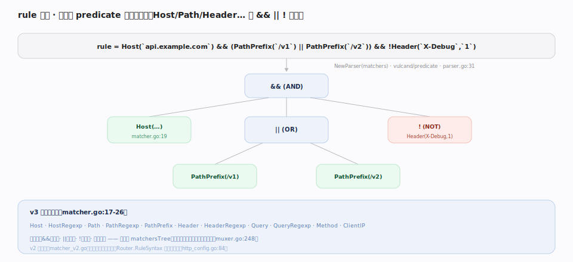
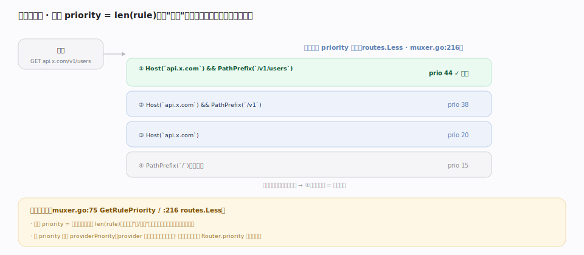

# Traefik 核心原理 · 支撑能力域 · Router 路由匹配

> **定位**：数据面的**定位能力域**。Router 决定一个进入 EntryPoint 的请求走哪条路径——用 `rule` 布尔表达式（`Host`/`Path`/`Header`… 以 `&&`/`||`/`!` 组合）匹配，用 `priority` 在多命中时裁决。Router 定义在动态配置里（`pkg/config/dynamic/http_config.go:84`），匹配引擎是 `Muxer`（`pkg/muxer/http/muxer.go`），规则解析基于 `vulcand/predicate`（`pkg/rules/parser.go`）。核实基准：本地源码 `traefik/v3`。

## 一、rule 语法：匹配器 + 布尔组合，编译成匹配树

一条 `rule` 是布尔表达式，如 `Host(...) && (PathPrefix(/v1) || PathPrefix(/v2)) && !Header(X-Debug,1)`。`NewParser(matchers)`（`parser.go:31`）用 `vulcand/predicate` 把它解析成 AST，再编译成 `matchersTree`（`muxer.go:236`）；请求到来时 `match` 自顶向下短路求值（`muxer.go:248`）。v3 匹配器目录（`matcher.go:17-26`）：**Host、HostRegexp、Path、PathRegexp、PathPrefix、Header、HeaderRegexp、Query、QueryRegexp、Method、ClientIP**。v2 旧语法（`matcher_v2.go`）仍兼容但已弃用，`Router.RuleSyntax` 可显式选版本（`http_config.go:84`，该字段标注 Deprecated）。

## 二、优先级：默认 len(rule)，越具体越优先

多条 Router 都可能匹配同一请求时，靠 `priority` 裁决：**默认 `priority = len(rule)`**（`GetRulePriority`，`muxer.go:75`）——规则字符串越长/越具体，优先级越高，无需手动排序。路由表按 priority 降序排列（`routes.Less`，`muxer.go:216`），请求自顶向下取**第一个匹配者**。同 priority 时再看 `providerPriority`（provider 声明顺序，`muxer.go:90`/`:218`）打破平局。需要时可显式设 `Router.priority` 覆盖默认（`http_config.go:84`）。

## 深化 · 匹配器语义

| 匹配器 | 匹配对象 | 备注 |
|---|---|---|
| `Host` / `HostRegexp` | 请求 Host / SNI | 精确或正则 |
| `Path` / `PathPrefix` / `PathRegexp` | URL 路径 | 精确 / 前缀 / 正则 |
| `Header` / `HeaderRegexp` | 请求头（键值 / 键+正则） | `Header` 取 2 参数 |
| `Query` / `QueryRegexp` | 查询参数 | 1~2 参数 |
| `Method` | HTTP 方法 | GET/POST… |
| `ClientIP` | 客户端 IP/CIDR | 结合 forwardedHeaders |

## 调优要点

- **让规则天然分层**：`Host(...) && PathPrefix(/api/v1/users)` 比裸 `PathPrefix(/)` 长得多，自动优先，兜底路由用短规则即可。
- **少用 `HostRegexp`/`PathRegexp`**：正则匹配比字符串匹配开销大，能用 `Host`/`PathPrefix` 就不用正则。
- **显式 `priority` 只在需要打破"长度=优先"时用**，否则依赖默认更省心。
- **`providers.precedence`** 调 Provider 声明顺序，解决同 priority 的跨 Provider 平局。

## 常见误区

- **以为要手写每条 priority**：默认按规则长度排，多数场景零配置就对。
- **混淆 `Path` 与 `PathPrefix`**：`Path` 精确匹配整条路径，`PathPrefix` 匹配前缀；用错会命中不到或过度命中。
- **用 v2 语法却没设 RuleSyntax**：v3 默认新语法，粘贴旧文档的 v2 规则可能解析异常；要么迁移到 v3，要么显式声明。
- **忘了 rule 是布尔表达式**：`Host(a) , Host(b)` 不是逗号分隔而应写 `Host(a) || Host(b)`。

## 一句话总纲

**Router 用 `rule` 布尔表达式（Host/Path/Header… 以 &&/||/! 组合）定位请求，编译成匹配树短路求值；多命中时按 `priority`（默认=规则长度，越具体越优先）裁决——把"最长匹配"变成了可读的声明式规则。**
