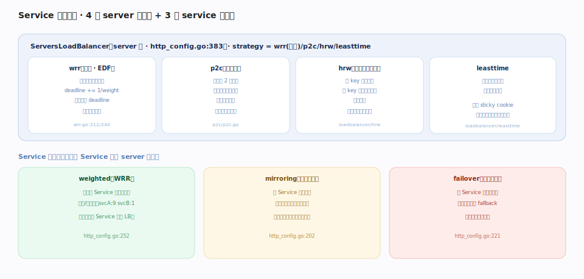
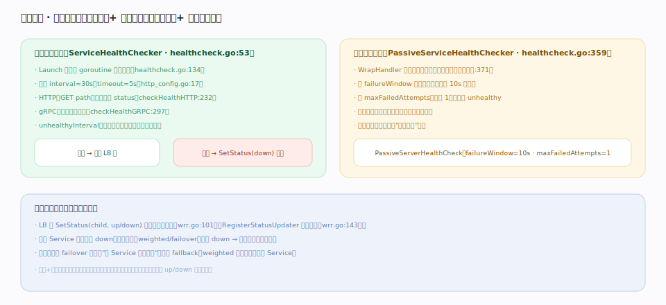

# Traefik 核心原理 · 支撑能力域 · Service 负载均衡与健康检查

> **定位**：数据面的**转发能力域**。Service 是请求的终点前一站——在多个后端 Server 间做负载均衡，用健康检查剔除坏后端并把状态向上传播实现自愈。Service 有四种形态（`loadBalancer`/`weighted`/`mirroring`/`failover`，`pkg/config/dynamic/http_config.go:62`），`ServersLoadBalancer` 支持 4 种 server 级策略（`http_config.go:383`），健康检查分主动/被动（`pkg/healthcheck/healthcheck.go`）。核实基准：本地源码 `traefik/v3`。

## 一、负载均衡：4 种 server 级策略 + 3 种 service 级组合

`ServersLoadBalancer` 的 `strategy`（`http_config.go:367`）有四种：**wrr（默认）** 用**最早截止时间优先（EDF）**——每次挑选 deadline 最小的后端，选后 `deadline += 1/weight`（`wrr.go:212`/`:240`），实现平滑加权轮询；**p2c** 随机取两个后端选连接更少者（近似最少连接，大规模友好）；**hrw** 最高随机权重（按 key 哈希稳定落同后端，会话保持）；**leasttime** 选响应最快的后端。之上还有**三种 service 级组合**：`weighted`（对多个 Service 按权重轮询，做灰度/金丝雀，`http_config.go:252`）、`mirroring`（主 Service 返回、按百分比镜像影子流量，`http_config.go:202`）、`failover`（主挂切 fallback，`http_config.go:221`）。`sticky`（cookie 会话保持）正交于策略。默认 `passHostHeader=true`（`http_config.go:22`）。

## 二、健康检查：主动探测 + 被动观测 + 状态向上传播

**主动**（`ServiceHealthChecker`，`healthcheck.go:53`）：`Launch()` 起后台 goroutine 定时探测（`healthcheck.go:134`），默认 `interval=30s`、`timeout=5s`（`http_config.go:17`），支持 HTTP（GET path 比对 status，`:232`）与 gRPC（`:297`）；`unhealthyInterval` 允许对不健康后端用更短间隔快速复检。**被动**（`PassiveServiceHealthChecker`，`healthcheck.go:359`）：`WrapHandler` 包在转发路径上观测真实请求，在 `failureWindow`（默认 10s）内累计失败达 `maxFailedAttempts`（默认 1）即标记 unhealthy，窗口内不再选该后端。**关键是状态向上传播**：LB 的 `SetStatus(child, up/down)`（`wrr.go:101`）更新子后端；若某 Service 全部后端 down 就向父级（weighted/failover）上报，父级把它整体摘除——层层传播使 failover 能感知"主已不可用"从而切 fallback。

## 深化 · 策略选型

| 策略 | 适用 | 特点 |
|---|---|---|
| `wrr`（默认） | 通用、后端能力已知 | 平滑加权、无状态 |
| `p2c` | 大量后端、请求耗时不均 | 近似最少连接、省状态 |
| `hrw` | 需会话保持 | 同 key 稳定落点、后端增减重分布少 |
| `leasttime` | 后端响应差异大 | 追随最快后端 |
| `sticky`（cookie） | 有状态会话 | 与上述策略叠加 |

## 调优要点

- **默认 wrr 已够用**；后端多且耗时不均时切 `p2c`。
- **主动+被动叠加**：主动定时兜底、被动实时快反应，两者都汇入同一套 up/down 传播。
- **`failover` 依赖健康检查**：不开健康检查，failover 无从判断"主已挂"。
- **`passHostHeader`** 决定是否把原始 Host 透传给后端，默认 true；后端按 Host 分虚拟主机时要保留。
- **健康检查 path/status 要真实反映就绪**：探活接口别只返回 200 而不校验依赖。

## 常见误区

- **wrr 是简单轮询**：不是，它是 EDF 平滑加权，权重不同的后端也能均匀交错而非扎堆。
- **`weighted` 用于 server 级加权**：错，server 级权重在 `loadBalancer.servers[].weight`；`weighted` 是 **Service 之间**的组合。
- **只配主动检查就够**：主动有 interval 延迟（默认 30s），突发故障靠被动更快摘除。
- **忽略状态传播**：单层 LB 摘后端只解决本层；要让 failover/weighted 生效必须在父子两级都开健康检查。

## 一句话总纲

**Service 在后端间做负载均衡（wrr(EDF)/p2c/hrw/leasttime）并支持 weighted/mirroring/failover 组合；主动探测 + 被动观测双管齐下，且把 up/down 状态层层向上传播——坏后端自动摘除、上层组合据此自愈。**
