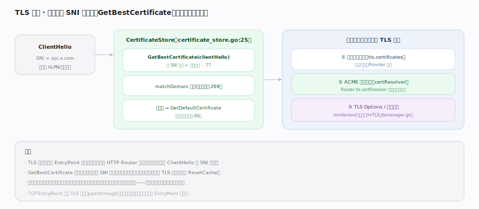
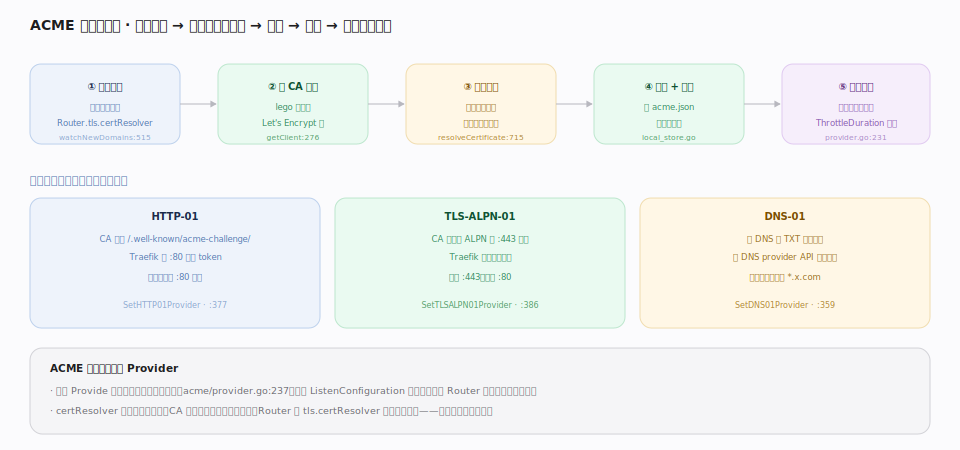

# Traefik 核心原理 · 支撑能力域 · TLS 与 ACME 证书自动化

> **定位**：数据面的**加密与信任能力域**。Traefik 在 EntryPoint 层终止 TLS，握手时按 SNI 从证书库选证书（`pkg/tls/certificate_store.go`）；更关键的是**原生 ACME**——按 Router 发现的域名自动向 CA（如 Let's Encrypt）签发/续期证书，无需人工申请与部署（`pkg/provider/acme/provider.go`）。这是它相对 nginx 的又一便利：nginx 通常需外部工具（certbot）续期，Traefik 内建。核实基准：本地源码 `traefik/v3`。

## 一、TLS 终止：握手时按 SNI 选证书

客户端 `ClientHello` 携带 SNI（如 `api.x.com`），`CertificateStore.GetBestCertificate(clientHello)`（`certificate_store.go:77`）按 SNI 匹配最合适的证书并**缓存结果**；匹配走 `matchDomain`（精确/通配，`:269`），无匹配则回退 `GetDefaultCertificate`（`:60`）兜底。证书**三类来源**：① 用户在动态配置 TLS 面提供的证书（文件/内容）；② ACME 自动签发（`certResolver` 触发）；③ TLS Options（minVersion/密码套件/mTLS，`tlsmanager.go`）。TLS 终止发生在 EntryPoint 层（收连接后、进 HTTP Router 前）；证书库随动态配置 TLS 面热更新后 `ResetCache`（`:175`）。

## 二、ACME：发现域名 → 挑战 → 签发 → 续期

ACME 是一个**特殊 Provider**：它 `watchNewDomains`（`acme/provider.go:515`）从 Router 的 `tls.certResolver` 发现要签的域名，用 lego 客户端（`getClient`，`:276`）向 CA 申请，完成**挑战**证明域名归属（`resolveCertificate`，`:715`），签发后存入 `acme.json`（`local_store.go`）与证书库，并在**到期前自动续期**（`ThrottleDuration` 节流，`:231`）。三种挑战二选一：**HTTP-01**（CA 访问 `/.well-known/acme-challenge/`，Traefik 在 :80 应答 token，`SetHTTP01Provider`，`:377`）、**TLS-ALPN-01**（CA 用特殊 ALPN 在 :443 握手验证，`SetTLSALPN01Provider`，`:386`）、**DNS-01**（写 DNS TXT 记录，经 DNS provider API 自动完成，唯一支持通配符 `*.x.com`，`SetDNS01Provider`，`:359`）。它既 `Provide` 配置（把签好的证书推回，`:237`）又 `ListenConfiguration` 消费配置——发现驱动、全自动。

## 深化 · 挑战方式选型

| 挑战 | 要求 | 支持通配符 | 场景 |
|---|---|---|---|
| HTTP-01 | :80 公网可达 | 否 | 最简单，单域名 |
| TLS-ALPN-01 | :443 公网可达 | 否 | 不想开 :80 |
| DNS-01 | DNS provider API 凭证 | **是** | 通配符、内网服务 |

## 调优要点

- **通配符证书用 DNS-01**：`*.example.com` 只能用 DNS-01，配好 DNS provider 的 API 凭证。
- **证书解析器在静态配置定义一次**：`certificatesResolvers.<name>.acme`（CA、邮箱、挑战方式、存储路径），Router 用 `tls.certResolver: <name>` 引用。
- **`acme.json` 权限 600**：里面有账户私钥与证书私钥，权限过松会被 lego 拒绝加载。
- **默认证书兜底**：为未覆盖的 SNI 准备一个默认证书，避免握手直接失败。
- **生产前先用 staging CA**：Let's Encrypt 有速率限制，调试用 staging 目录避免触顶。

## 常见误区

- **以为 ACME 要手动跑**：完全自动——发现域名即签、到期即续，无需 cron/certbot。
- **HTTP-01 却把 :80 重定向到 :443**：会导致挑战路径也被重定向而失败；给 acme-challenge 路径放行或改用 TLS-ALPN-01/DNS-01。
- **通配符用 HTTP-01/TLS-ALPN-01**：不支持，必须 DNS-01。
- **多实例共享 acme.json 文件**：并发写会冲突；多实例应共用分布式存储或让单实例负责签发（或用 KV 存储）。

## 一句话总纲

**Traefik 在 EntryPoint 按 SNI 选证书终止 TLS，并把 ACME 做成一个"发现域名即自动签发续期"的内建 Provider（HTTP-01/TLS-ALPN-01/DNS-01 三选一）——把证书生命周期从人工运维变成发现驱动的全自动。**
