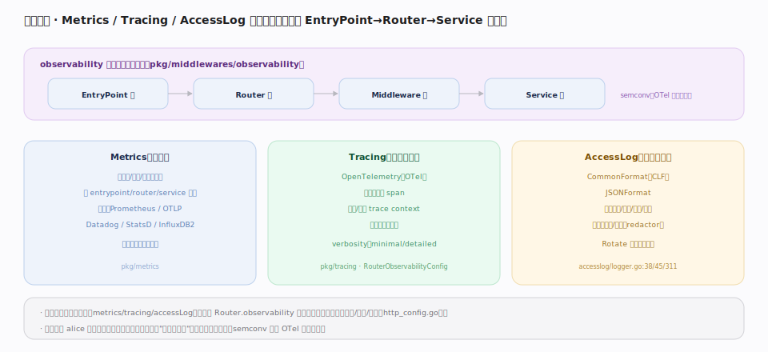

# Traefik 核心原理 · 支撑能力域 · 可观测性

> **定位**：横切数据面的**观测能力域**。Traefik 把 Metrics（指标）、Tracing（链路追踪）、AccessLog（访问日志）三支柱以 **alice 中间件形态**挂在 EntryPoint→Router→Middleware→Service 各层（`pkg/middlewares/observability`），因此"包裹全链路"而不侵入业务。全局开关在静态配置，路由级可用 `Router.observability` 精细控制（`pkg/config/dynamic/http_config.go`）。核实基准：本地源码 `traefik/v3`。

## 一、三支柱：埋点在各层，语义由 semconv 统一

observability 中间件在每层埋点：**Metrics**（`pkg/metrics`）统计请求数/时延/状态码分布，按 entrypoint/router/service 维度暴露，后端支持 Prometheus/OTLP/Datadog/StatsD/InfluxDB2，健康检查失败也计数；**Tracing**（`pkg/tracing`）基于 OpenTelemetry 为每请求生成 span、注入并透传 trace context 与后端链路串联，verbosity 分 minimal/detailed（`RouterObservabilityConfig`）；**AccessLog**（`pkg/middlewares/accesslog/logger.go`）支持 CommonFormat（CLF，`:38`）与 JSONFormat（`:45`），记录时延/状态/后端/重试等，字段可过滤/脱敏（redactor），`Rotate` 支持日志切割（`:311`）。三者的语义标签由 **semconv**（OTel 语义约定，`observability/semconv.go`）统一。

## 深化 · 三支柱对照

| 支柱 | 回答的问题 | 后端 | 源码 |
|---|---|---|---|
| Metrics | "整体量级/趋势如何" | Prometheus/OTLP/Datadog/StatsD/InfluxDB2 | `pkg/metrics` |
| Tracing | "这一个请求在哪慢了" | OpenTelemetry collector | `pkg/tracing` |
| AccessLog | "谁在什么时候访问了什么" | 文件/stdout（CLF/JSON） | `accesslog/logger.go` |

## 调优要点

- **AccessLog 用 JSON + 字段过滤**：便于日志系统结构化解析；高流量下按需 drop 低价值字段降开销。
- **路由级精细控制**：热点但无需追踪的路由可 `observability.tracing=false` 降采样开销；关键路由开 detailed。
- **Metrics 维度别爆炸**：按 service 维度足够时不要额外拉高基数（如按 path 标签）导致时序膨胀。
- **Tracing 透传 context**：确保上下游都用兼容的 trace 传播格式，链路才能串起来。

## 常见误区

- **以为可观测会侵入业务**：三者都是中间件，挂在数据面各层，业务后端无感知。
- **AccessLog 与 Tracing 混用**：日志回答"发生了什么"、追踪回答"这次请求路径与耗时分解"，互补不替代。
- **全局开 detailed 追踪**：开销大且噪声多，应默认 minimal、按需对关键路由提级。
- **忘了脱敏**：AccessLog 可能含敏感头/查询参数，用 redactor 过滤后再落盘。

## 一句话总纲

**可观测性是横切全链路的中间件三支柱：Metrics 看量级、Tracing 看单请求路径、AccessLog 看逐条访问，埋点在 EntryPoint→Router→Service 各层、语义由 OTel semconv 统一，全局开关加路由级精细控制。**
