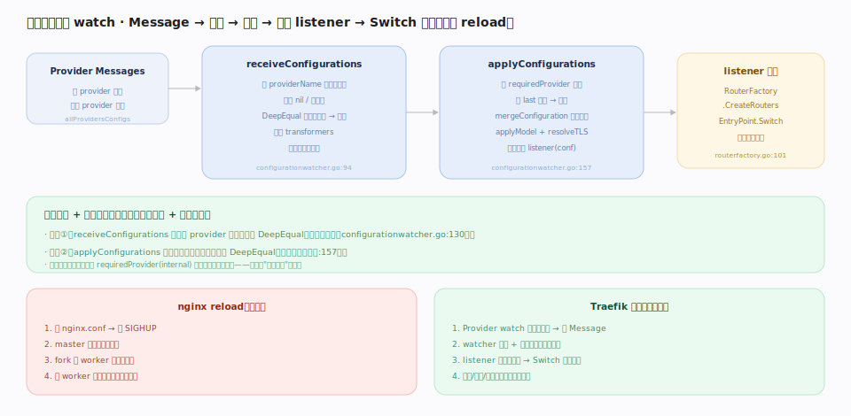

# Traefik 核心原理 · 支撑能力域 · 热加载与配置 watch

> **定位**：连接控制面与数据面的**生效能力域**，也是"无需 reload"承诺的落地处。Provider 推来的 `dynamic.Message` 经 `ConfigurationWatcher`（`pkg/server/configurationwatcher.go`）两道去重、合并、就绪判定后，通过 listener 触发路由表重建与 `EntryPoint.Switch` 原子替换——进程、端口、连接全不动。这是 Traefik 相对 nginx `SIGHUP reload` 的根本差异。核实基准：本地源码 `traefik/v3`。

## 一、配置 watch 管线：去重 → 合并 → 通知 → 热替换

`ConfigurationWatcher.Start` 起两个 goroutine：**`receiveConfigurations`**（`configurationwatcher.go:94`）从聚合通道收各 provider 的 `dynamic.Message`，按 `providerName` 存最新配置，跳过 nil/空，并对每个 provider 的新配置做 `reflect.DeepEqual` **去重①**（未变即丢弃，`:130`），再跑 transformers，输出全量配置集；**`applyConfigurations`**（`:157`）先等 `requiredProvider`（internal）就绪（**就绪闸门**，防止用半份配置启动），再对合并后的全量集与上次做 `DeepEqual` **去重②**（相同不下发），然后 `mergeConfiguration`（合并多源）+ `applyModel` + `resolveHTTPTLSOptions`，最后调用每个注册的 `listener(conf)`。listener 里由 `RouterFactory.CreateRouters`（`routerfactory.go:101`）重建路由表并 `EntryPoint.Switch` 换内存路由表。

## 二、与 nginx reload 的对照

**nginx reload**：改 `nginx.conf` → 发 `SIGHUP` → master 重读校验 → fork 新 worker 接管新连接 → 旧 worker 处理完存量连接后退出（有进程更替）。**Traefik 热加载**：Provider watch 到外部变更 → 推 Message → watcher 去重合并（不重启进程）→ listener 重建路由表 → `Switch` 原子替换 → 端口/进程/连接全不动、秒级生效。两者都追求"配置更新不断连接"，但 nginx 靠进程更替、Traefik 靠内存路由表原子替换——后者无 fork 开销、无进程切换窗口。

## 深化 · 三个防抖/防错机制

| 机制 | 位置 | 作用 |
|---|---|---|
| Provider 级 throttle | `aggregator.go:32` | 合并单 provider 的突发事件（ringChannel） |
| 去重①（单 provider） | `configurationwatcher.go:130` | 该 provider 配置没变就不往下传 |
| 去重②（全量集） | `configurationwatcher.go:157` | 合并后与上次相同就不下发/不重建 |
| 就绪闸门 | `configurationwatcher.go:157` | 等 requiredProvider 才首次应用，避免半份配置 |

## 调优要点

- **`providersThrottleDuration`** 是第一道防抖，抖动环境调大以合并突发。
- **依赖去重降开销**：两道 DeepEqual 让"重复推同一份配置"不触发重建，Provider 端可放心整包重推。
- **别绕过 requiredProvider**：自定义部署若误关 internal provider，watcher 可能永不认为初始化完成。
- **观测配置变更**：结合日志（`logConfiguration`，`:192`）确认每次变更被正确接收/去重/应用。

## 常见误区

- **以为热加载会丢连接**：不会——`Switch` 只换内存路由表，已建连接继续用旧 handler 处理完，新连接走新表。
- **以为每次 Provider 推送都重建**：两道去重挡掉无变化的推送，只有真变了才重建。
- **把 File Provider 的 watch 当 nginx reload**：File 保存即热加载，走的是同一条 watch→Switch 管线，无进程更替。
- **忽略合并语义**：多 Provider 的配置会 merge，同名对象按 `@provider` 与 precedence 处理，冲突不是"后者覆盖前者"那么简单。

## 一句话总纲

**热加载是"无需 reload"的落地：Provider 推来的配置经 watcher 两道 DeepEqual 去重 + 就绪闸门 + 合并后，由 listener 重建路由表并 Switch 原子替换内存路由表——进程、端口、连接全程不动，秒级生效。**
