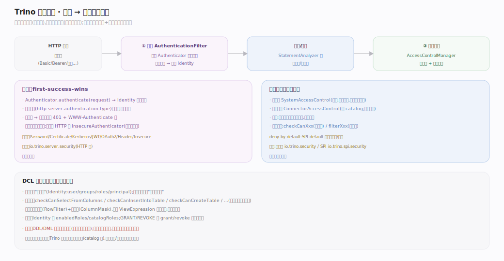
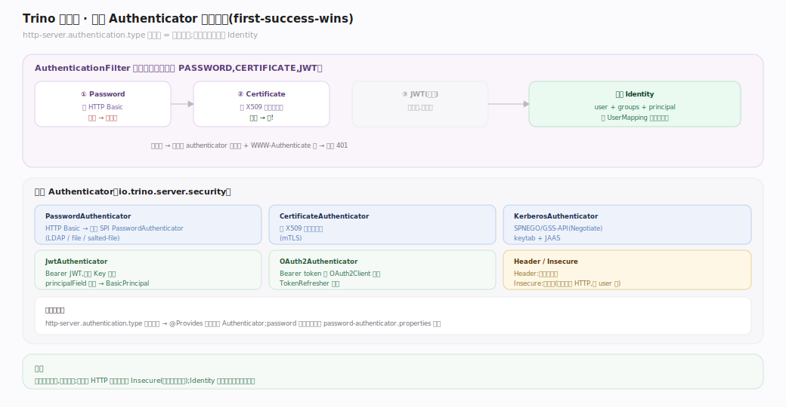
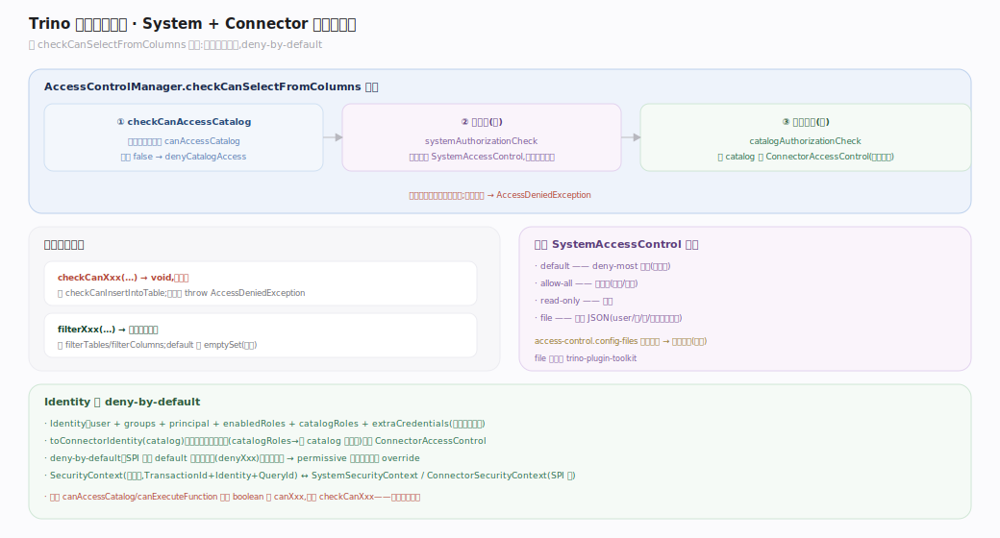
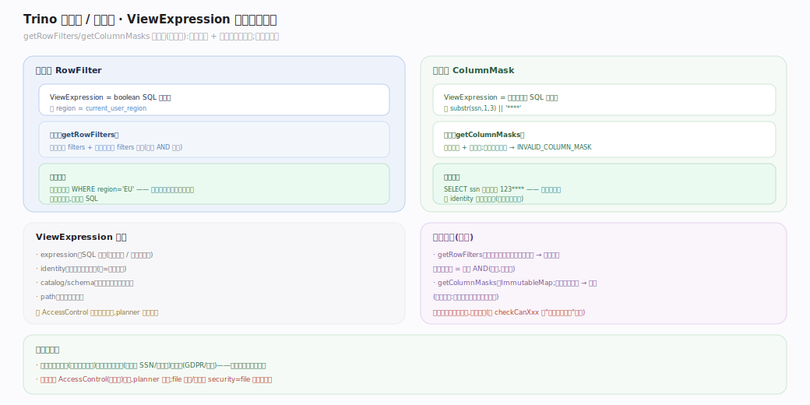

# Trino 原理 · DCL 数据控制（安全）

> **定位**：接触面主线之一，同时是横切所有主线的"安全"能力域。管**认证**（你是谁）与**访问控制**（你能做什么）。特点是**两层叠加**：系统级 `SystemAccessControl` + 连接器级 `ConnectorAccessControl`，二者都过、结果合并。被 DQL/DDL/DML 全依赖（每条语句都要鉴权）。源码基准 **Trino 483-SNAPSHOT**。

Trino 的安全分两段：请求进来先过**认证过滤链**（HTTP 层，确定 Identity），再在语义分析/执行时过**访问控制**（能否 select 这些列、能否建表、行过滤/列掩码）。访问控制是**两层**的——系统级（集群范围）先判，连接器级（catalog 范围）再判，都通过才放行。

---

## 一、安全全景：认证 → 访问控制两段

- **认证（HTTP 层）**：`AuthenticationFilter` 按配置的有序 `Authenticator` 列表逐个尝试，**首个成功即确定 `Identity`**（first-success-wins）；全失败聚合成一个 401 + `WWW-Authenticate` 头。安全连接用全列表，非安全 HTTP 仅用 `InsecureAuthenticator`（需显式允许）。
- **访问控制（分析/执行）**：`AccessControlManager` 组合系统级 + 连接器级——`checkCanXxx` 抛异常式 + `filterXxx` 返回子集式。系统级先判、连接器级后判，都过才放行。

---

## 二、认证过滤链：first-success-wins

`Authenticator.authenticate(request)` 返回 `Identity` 或抛 `AuthenticationException`。`AuthenticationFilter` 持有**有序**列表（来自 `http-server.authentication.type`），逐个尝试首个成功即用。内置认证器：`PasswordAuthenticator`（HTTP Basic → LDAP/file/salted）、`CertificateAuthenticator`（X509 客户端证书）、`KerberosAuthenticator`（SPNEGO/GSS）、`JwtAuthenticator` / `OAuth2Authenticator`（Bearer token）、`HeaderAuthenticator`（可信头）、`InsecureAuthenticator`（无凭据，仅非安全 HTTP）。列表顺序 = 尝试顺序。

---

## 三、两层访问控制：系统级 + 连接器级

`AccessControlManager`（实现引擎侧 `AccessControl`）的组合逻辑：

- **系统级**（`SystemAccessControl` 列表，全部咨询）：`systemAuthorizationCheck` 遍历所有系统控制器，任一抛异常即失败。内置 `default`/`allow-all`/`read-only`/`file` 四种工厂。
- **连接器级**（`ConnectorAccessControl`，按 catalog）：`catalogAuthorizationCheck` 解析该 catalog 的连接器控制器；catalog 无控制器则**空操作**（放行）。
- **顺序**：系统级先判、连接器级后判，**两者都必须过**。
- **deny-by-default**：SPI 所有 default 方法都拒绝或返回空子集——permissive 插件必须显式 override。

以 `checkCanSelectFromColumns` 为例：先 `checkCanAccessCatalog` → 再系统级 `checkCanSelectFromColumns` → 再连接器级——三关都过才允许读这些列。

---

## 深化 · 行过滤与列掩码（两层合并）

`ViewExpression` 表示一个行过滤（boolean SQL 表达式）或列掩码（改写列值的 SQL 表达式）。`getRowFilters`/`getColumnMasks` 是**合并式**（不短路）：先取连接器级，再叠加每个系统级控制器的——`getRowFilters` 结果拼接（多个过滤 AND 生效），`getColumnMasks` 若两源掩同一列则抛 `INVALID_COLUMN_MASK`。行过滤把 `WHERE 表达式` 注入查询、列掩码把 `列` 替换成表达式（如 `substr(ssn,1,3)||'****'`），对用户透明。

## 拓展 · 认证与访问控制配置

| 组件 | 配置 | 说明 |
|---|---|---|
| 认证类型 | `http-server.authentication.type` | 有序列表（如 `PASSWORD,CERTIFICATE`），= 尝试顺序 |
| 系统访问控制 | `etc/access-control.properties` (`access-control.name`) 或 `access-control.config-files`（多个可叠加） | 内置 default/allow-all/read-only/file |
| 密码认证器 | `password-authenticator.properties`（`password-authenticator.name`） | LDAP/file/salted 插件 |
| 连接器访问控制 | 各 catalog 的 `security=file` + 规则 JSON | 连接器级行过滤/列掩码/权限 |

## 常见误区与工程要点

- **误区：只有一层访问控制。** 两层——系统级 + 连接器级，都过才行；行过滤/列掩码两层还会合并。
- **误区：`canAccessCatalog` 是 `checkCanAccessCatalog`。** 它是返回 boolean 的 `canAccessCatalog`（不抛异常）；命名区分了 throwing (`checkCanXxx`) 与 boolean/filter 两风格。
- **误区：认证器全部都试、取最优。** 是 first-success-wins（首个成功即停），顺序即优先级。
- **误区：默认放行。** SPI deny-by-default——不配 permissive 控制器时默认拒绝敏感操作。
- **归属提醒**：认证在 `io.trino.server.security`（HTTP 层）；访问控制引擎侧在 `io.trino.security`、SPI 在 `io.trino.spi.security`；file 插件在 `trino-plugin-toolkit`。DDL/DML 的鉴权也走这套（本篇覆盖控制面，语句执行在各接触面主线）。

## 一句话总纲

**DCL 分两段：请求先过认证过滤链（有序 Authenticator 列表 first-success-wins 确定 Identity），再过两层访问控制——AccessControlManager 先咨询所有系统级 SystemAccessControl、再咨询该 catalog 的 ConnectorAccessControl，两者都过才放行（deny-by-default，checkCanXxx 抛异常 / filterXxx 返子集）；行过滤与列掩码由两层 ViewExpression 合并注入，对用户透明。**
