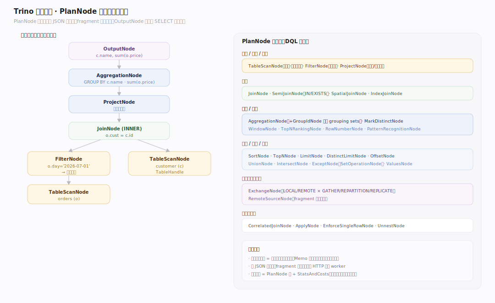
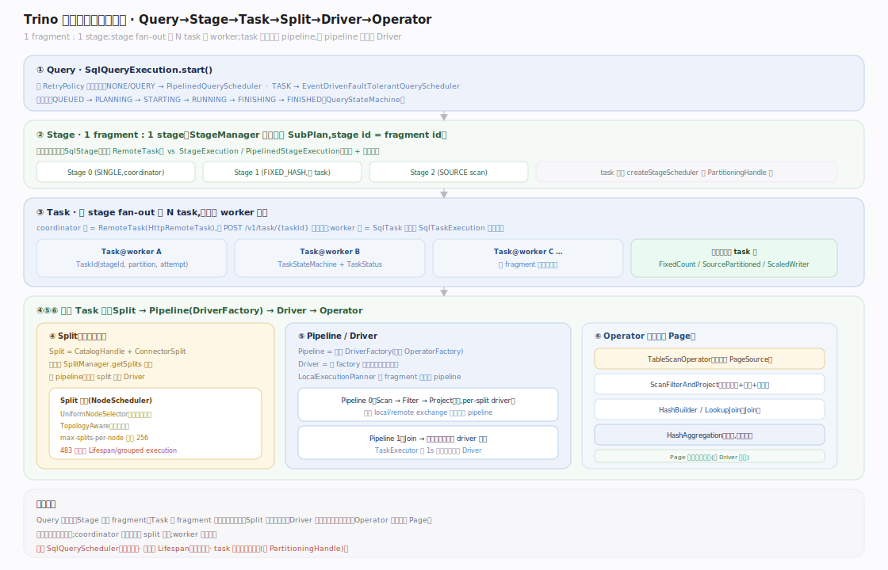
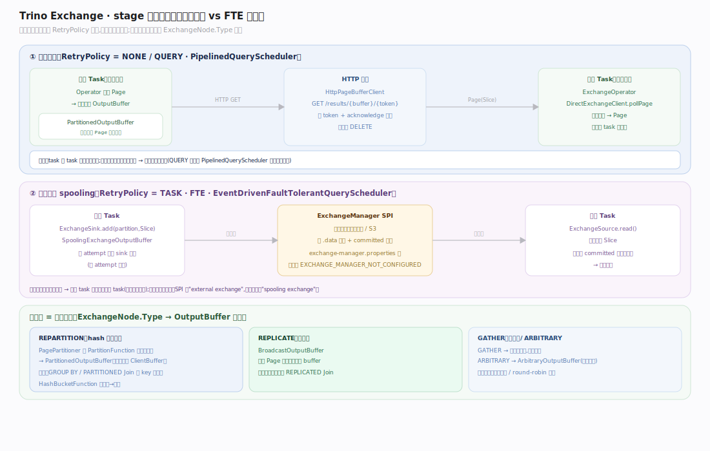
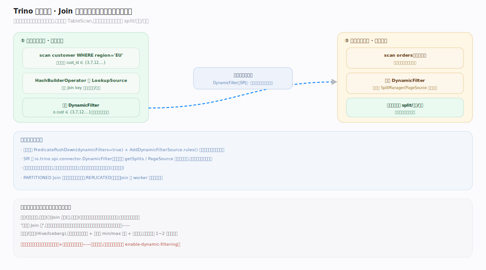

# Trino 原理 · DQL 数据查询

> **定位**：本篇是 Trino 的**主接触面主线**——一条 `SELECT` 从文本到结果的完整链路。属"计算能力域"的核心，依赖【连接器框架】拿数据、【查询规划与优化】定计划、【分布式执行】跑计划、【调度与资源】分任务、【内存管理】保内存、【数据交换】搬数据。它统领全库：其余支撑主线都是这条链路上某一段的展开。源码基准 **Trino 483-SNAPSHOT**（`~/workdir/trino`）。

Trino 没有 DDL/DML 作为独立主线（多下推给连接器，见【连接器框架】），DQL 才是引擎的主战场。一条查询在 **coordinator** 上被解析、分析、规划、优化、切成 fragment，再分发到 **worker** 集群以 `Query→Stage→Task→Split→Driver→Operator` 六级并行执行，数据以列式 `Page` 在算子间流动、经 `Exchange` 跨 stage 交换，最终汇聚回 coordinator 返回客户端。

---

## 一、查询执行全景：一条 SELECT 的一生

全景分两大阶段、六级层次：

- **coordinator 编排（前台单脑）**：`SqlParser` 解析 SQL 文本成 AST（`Statement`）→ `StatementAnalyzer` 语义分析产出 `Analysis`（绑定库表/类型/函数）→ `LogicalPlanner` 生成逻辑 `PlanNode` 树 → `PlanOptimizers` 迭代优化（含 CBO 定 Join 顺序与分布）→ `PlanFragmenter` 按 REMOTE exchange 切成 `SubPlan`（fragment 树）→ 按 `RetryPolicy` 选调度器分发。
- **worker 执行（并行多机）**：每个 fragment 对应一个 stage，fan-out 成多个 task 分布到 worker；task 内 `LocalExecutionPlanner` 把 fragment 编译成若干 pipeline（`DriverFactory`），每 pipeline 起多个 `Driver` 并行，`Driver` 泵动 `Operator` 链处理 `Page`；stage 间经 `Exchange` 交换。

贯穿示例（全库统一）：`SELECT c.name, sum(o.price) FROM orders o JOIN customer c ON o.cust=c.id WHERE o.day='2026-07-01' GROUP BY c.name` —— 后续每一节都追踪它在该层的形态。

---

## 二、前台编排链路（coordinator 内）

关键点（每处均可回源码核实）：

- **解析（ANTLR4，两阶段预测）**：`SqlParser.createStatement` 先用快速的 `SLL` 预测模式配 `BailErrorStrategy`，失败再回退 `LL` 模式重试；`AstBuilder` 把 ANTLR 解析树转成 `io.trino.sql.tree.*` 的 `Statement` AST。语法定义在独立的 `trino-grammar` 模块（`SqlBase.g4`）。
- **分析产出的是"旁表"不是新树**：`Analyzer.analyze` 先 `StatementRewrite`（展开视图、`SHOW`→`SELECT`、预处理参数），再 `StatementAnalyzer` 递归下降构建 `Scope`/`RelationType`/`Field`，`ExpressionAnalyzer` 解析类型与函数——所有结果写进一个可变的 `Analysis` 对象。planner 从 `Analysis` 读类型/函数/作用域，**AST 本身不被改写**。分析末尾做访问控制（对每个引用的表/列 `checkCanSelectFromColumns`）。
- **逻辑计划以 `OutputNode` 为根**：`LogicalPlanner.plan` → `RelationPlanner`（FROM/JOIN/集合运算）+ `QueryPlanner`（每个 SELECT 的子句链）构建 `PlanNode` 树；`OutputNode` 永远是 SELECT 的逻辑根。子句成节点的顺序：FROM→WHERE(`FilterNode`)→聚合(`AggregationNode`)→HAVING→窗口(`WindowNode`)→投影(`ProjectNode`)→DISTINCT→ORDER BY/LIMIT。

---

## 三、逻辑计划与算子节点

`PlanNode` 是不可变、可 JSON 序列化的（fragment 要走网络）。DQL 相关的核心节点族：扫描 `TableScanNode`、过滤 `FilterNode`、投影 `ProjectNode`、连接 `JoinNode`/`SemiJoinNode`/`SpatialJoinNode`、聚合 `AggregationNode`（+`GroupIdNode` 处理 grouping sets）、窗口 `WindowNode`、排序 `SortNode`/`TopNNode`、限制 `LimitNode`、集合 `UnionNode`/`IntersectNode`/`ExceptNode`、以及分布式化后插入的 `ExchangeNode`/`RemoteSourceNode`。一个查询计划 = `PlanNode` 根 + `StatsAndCosts`（每节点的统计与代价估计）。

---

## 四、优化器：迭代规则改写 + 局部 CBO

Trino 的优化器**不是 Cascades**——这是最易讲错的一点，必须说准：

- **`IterativeOptimizer` 是"规则改写到定点"，不是自顶向下代价搜索。** 它把计划放进 `Memo`，但 `Memo` 的每个 `Group` 只持有**单个** `PlanNode`（`membership`），由 `replace` 就地替换——不是 Cascades 那种"一组等价表达式"。`Lookup.resolve` 的 javadoc 明写"assumes group contains only one node"。驱动逻辑 `exploreGroup`/`exploreNode` 对每个节点反复套用 `RuleIndex` 里匹配的规则，直到没有规则再触发（fixpoint）。`Memo` 在这里是**改写效率结构**（避免不可变树的全量重建），不是代价搜索的解空间。
- **CBO 是"局部"的**：全局是规则改写，只有 Join 顺序与分布这两处是真正的代价枚举。
- **优化批次是有序流水线**：`PlanOptimizers` 把数十个 `IterativeOptimizer` 批次按固定顺序排列——谓词下推、投影下推、去关联子查询、下推进 TableScan（`applyFilter`/`applyProjection` 等 SPI）、消除 Cross Join、Join 重排、加 Exchange、动态过滤下推……`AddExchanges` 之后代价计算器从"含预估 exchange"切换为"不含"。

**术语要精确**：说"迭代规则优化器 + Memo 改写结构 + 局部 CBO"，不要笼统说"Cascades 优化器"或"代价优化器"。

---

## 五、CBO：Join 重排与分布决策

两个代价驱动的规则（都受 `CostComparator` 按 CPU/内存/网络加权比较）：

- **`ReorderJoins`（Join 顺序）**：仅在 `join_reordering_strategy=AUTOMATIC` 时启用，只跑一次。先把可重排的 INNER Join 树压平成 `MultiJoinNode`（受 `max_reordered_joins` 上限约束），再用 **`JoinEnumerator` 做记忆化动态规划**：对连通子集 `generatePartitions` 穷举"分成两半"的所有方式，自底向上 DP，`memo` 缓存每个子集的最优结果。这是经典的子集 DP 枚举，**不是 DPhyp/超图**——别写成 DPhyp。
- **`DetermineJoinDistributionType`（Join 分布）**：`AUTOMATIC` 时枚举 `PARTITIONED`（双边按 key 重分区）vs `REPLICATED`（广播小表）两种分布 × 两种左右顺序，取代价最小；代价不可估时回退按大小的启发式（`join_max_broadcast_table_size` + 8× 尺寸差阈值翻转构建侧）。

`DetermineJoinDistributionType` 必须在 `AddExchanges` 之前跑。分布决定了后续插入哪种 `ExchangeNode`。

---

## 六、分布式化：fragment 切分与分布句柄

`PlanFragmenter` 把优化后的单棵逻辑计划切成 `SubPlan` 树（fragment 树）：

- **剪点是 REMOTE 的 `ExchangeNode`**。`Fragmenter.visitExchange`：`LOCAL` exchange 留在 fragment 内不切；`REMOTE` exchange 处把子树拆成独立子 fragment，父 fragment 里对应位置替换成 `RemoteSourceNode`（携带子 fragment id + 交换类型）。`SubPlan` 的结构不变量：父 fragment 的 `RemoteSourceNode` 源 id 多重集 == 子 fragment id 多重集。
- **一个 fragment 带两个分布**：执行分布 `partitioning`（本 fragment 的 task 怎么分布）和输出分布 `outputPartitioningScheme`（输出怎么分给父 fragment）——别混为一谈。
- **`ExchangeNode` 三型 × 两 scope**：型 = `GATHER`（汇聚到单点）/`REPARTITION`（按 key 重分区）/`REPLICATE`（广播）；scope = `LOCAL`（worker 内）/`REMOTE`（跨 worker，才是 fragment 剪点）。系统分布句柄有 `SINGLE`/`FIXED_HASH`/`FIXED_BROADCAST`/`FIXED_ARBITRARY`/`SOURCE`/`COORDINATOR_ONLY`/`SCALED_WRITER` 等（`SystemPartitioningHandle`）。

---

## 七、分布式执行层次：Query→Stage→Task→Split→Driver→Operator

这是 Trino 执行模型的骨架，六级严格对应：

- **Query**：`SqlQueryExecution.start` 驱动全程；按 `RetryPolicy` 选 `PipelinedQueryScheduler`（NONE/QUERY）或 `EventDrivenFaultTolerantQueryScheduler`（TASK）。
- **Stage**：**1 fragment : 1 stage**（`StageManager.create` 广度遍历 SubPlan，每 fragment 建一个 `SqlStage`，stage id 直接取自 fragment id）。注意两个对象：`SqlStage`（持有 `RemoteTask`）vs `StageExecution`/`PipelinedStageExecution`（调度与状态机）。
- **Task**：一个 stage fan-out 成 N 个 task（数量由该 fragment 的 `PartitioningHandle` 经 `createStageScheduler` 决定：`FixedCountScheduler` 一节点一 task、`SourcePartitionedScheduler` 随 split 动态、`ScaledWriterScheduler` 随数据量增长）。coordinator 端每 task 是一个 `RemoteTask`（`HttpRemoteTask`），经 `POST /v1/task/{taskId}` 远程创建；worker 端 `SqlTask` 容器包着 `SqlTaskExecution` 运行实例。
- **Split**：数据分片，`Split` = `CatalogHandle` + 连接器私有的 `ConnectorSplit`。**源 pipeline 一个 split 一个 driver**。（注：Trino 483 已**移除 Lifespan/grouped execution**，split 上无 lifespan 字段。）
- **Driver / Operator**：一个 pipeline = 一个 `DriverFactory`（一串 `OperatorFactory`）；一个 `Driver` = 从该 factory 实例化的一条算子链。`LocalExecutionPlanner` 把 fragment 编译成多个 pipeline，每遇 local/remote exchange 边界起新 pipeline。

---

## 八、Driver 泵与 Page 流动

- **`Operator` 契约**是协作式状态机：`isBlocked` 返回 future（算子从不阻塞线程）、`needsInput`/`addInput(Page)` 收输入、`getOutput` 出输出（无则返 `null`）、`finish`/`isFinished` 收尾，外加 `startMemoryRevoke`/`finishMemoryRevoke` 溢写钩子。
- **`Driver.processInternal` 是泵**：先 `processNewSources` 把新到的 split 喂给源算子，再遍历相邻算子对——若 `current` 未完成且 `next.needsInput`，就 `page = current.getOutput` 然后 `next.addInput(page)`，front-to-back 一次搬一个 Page；`current` 完成则 `next.finish`。单个 Driver 单线程（持独占锁）。
- **`Page` 是列式批**：N 个 `Block`（列）× M 行（positions）。`Block` 是 `sealed interface`，只允许 `DictionaryBlock`/`RunLengthEncodedBlock`/`ValueBlock` 三种，编码包装经 `getUnderlyingValueBlock` 解引用。**Page 大小按字节界定（默认上限 1MB），不是固定 1024 行**——说"约 1MB 的列式批/几千行"，别写"每页 1024 行"。
- **执行器与时间片**：`Driver` 被 `TaskExecutor` 以 1 秒 `SPLIT_RUN_QUANTA` 时间片调度。Trino 483 **默认 `ThreadPerDriverTaskExecutor`（一 driver 一线程）**，可切换回经典的 `TimeSharingTaskExecutor`（多级反馈队列时间片）；两者都用 1 秒配额。

---

## 九、数据交换：Exchange 如何搬数据

stage 间数据移动由 exchange 承担，**传输方式在运行期由 `RetryPolicy` 决定，不在计划里定死**：

- **流式（NONE/QUERY 策略）**：`DirectExchangeClient` 经 `HttpPageBufferClient` HTTP GET 直接从上游 task 的 `OutputBuffer` 拉序列化 Page（`{token}` 翻页 + `acknowledge` 释放 + 完成时 DELETE）。`ExchangeOperator` 反序列化成 Page。
- **溢出暂存（TASK 策略，FTE）**：经 `ExchangeManager` SPI（引擎内部叫 spooling exchange）把数据落到外部存储（文件系统/S3），支持 task 重试去重。需配 `exchange-manager.properties`，否则 `EXCHANGE_MANAGER_NOT_CONFIGURED`。
- **发送侧 = 分区去向**：`REPARTITION`（hash）→ `PagePartitioner` 按 `PartitionFunction` 逐行算分区 → `PartitionedOutputBuffer`；`REPLICATE` → `BroadcastOutputBuffer`（拷到所有 buffer）；`GATHER` → 单分区输出。`LOCAL` exchange 用同样的分区语义，但 Page 在 worker 内存里直接交手（`LocalExchangeSource`），不序列化不走网络。

---

## 深化 · 动态过滤（Dynamic Filtering）

Join 时先用构建侧（小表）的实际值域生成运行时谓词，回推到探测侧（大表）的 `TableScan`，让连接器在读数据前就跳过不匹配的 split/文件/行组。SPI 侧 `DynamicFilter` 接口，规划侧由 `PredicatePushDown`（第三参 `true`）+ `AddDynamicFilterSource` 插入。这是 Trino 大表 Join 提速的关键——探测侧扫描量可数量级下降。

---

## 深化 · 谓词与投影下推进连接器

优化器通过 `ConnectorMetadata` 的 `applyFilter`/`applyProjection`/`applyAggregation`/`applyLimit`/`applyTopN`/`applyJoin` 把计算下推给连接器（能推多少由连接器实现决定，返回"已下推部分 + 剩余部分"，迭代进行）。推下去的部分在数据源侧执行（如 JDBC 连接器把 filter 变成 SQL WHERE、Hive 连接器按分区裁剪），Trino 侧只处理剩余部分——**这是"联邦下推"省带宽的核心**。

---

## 拓展 · 算子族一览

| 算子 | 类 | 作用 |
|---|---|---|
| 表扫描 | `TableScanOperator` / `ScanFilterAndProjectOperator` | 从连接器 `ConnectorPageSource` 拉 `SourcePage`→Page；后者融合扫描+过滤+投影为一条 WorkProcessor 流水 |
| 哈希聚合 | `HashAggregationOperator` | 按 group-by 键建哈希表；满或收尾时流式出结果；可溢写（revocable 内存） |
| 哈希 Join | `HashBuilderOperator`（构建侧）/ `LookupJoinOperator`（探测侧） | 构建侧把右表灌进 `PagesIndex` 建 `LookupSource`；探测侧逐行查找；483 中为 WorkProcessor 算子；可溢写 |
| 交换 | `ExchangeOperator` / `MergeOperator` | 从远端拉 Page（`MergeOperator` 做保序 k 路归并 GATHER） |
| TopN | `TopNOperator` | 输入期维护有界堆，收尾时排出 top-N |
| 排序 | `OrderByOperator` | 全量排序；可溢写 |

## 调优要点（关键开关，均源码核实）

- `join_distribution_type`（`AUTOMATIC`/`BROADCAST`/`PARTITIONED`）、`join_reordering_strategy`（`AUTOMATIC`/`ELIMINATE_CROSS_JOINS`/`NONE`）、`join_max_broadcast_table_size`——控制 Join 分布与重排。
- `query.max-memory`（全查询跨集群）、`query.max-memory-per-node`（单节点，默认可用内存 30%）、`memory.heap-headroom-per-node`（默认 30%）——内存上限。
- `retry-policy`（`NONE`/`QUERY`/`TASK`）——容错级别；`TASK` 需配 exchange-manager。
- `spill-enabled` + `spiller-spill-path`——聚合/Join/排序/窗口的溢写。
- `optimizer.dictionary-aggregation`、动态过滤相关 `enable-dynamic-filtering`。
- `node-scheduler.policy`（`UNIFORM`/`TOPOLOGY`）、`node-scheduler.max-splits-per-node`（默认 256）——split 放置。

## 常见误区与工程要点

- **误区：Trino 优化器是 Cascades。** 不是。它是迭代规则改写到定点（单成员 Memo），CBO 只局部用于 Join 顺序（子集 DP）与分布——不是全 plan 的自顶向下代价搜索。
- **误区：Page 是"每页约 1024 行"。** 错。Page 按字节界定，默认上限约 1MB；投影批上限 8192 positions。
- **误区："流式 vs 物化 exchange 在计划期选定"。** 不是。fragment 是传输无关的，同一个 `RemoteSourceNode` 在运行期按 `RetryPolicy` realized 成直连流式或 spooling 暂存。
- **误区：还有 Lifespan/grouped execution。** Trino 483 已移除。别引用 `Lifespan`/`GroupedExecution`。
- **误区：调度器叫 `SqlQueryScheduler`。** 不存在。接口是 `QueryScheduler`，实现 `PipelinedQueryScheduler` / `EventDrivenFaultTolerantQueryScheduler`。
- 归属提醒：split 生成属【连接器框架】不属【调度】；动态过滤属【查询规划与优化】+【连接器框架】协作；内存溢写属【内存管理】，本篇只讲算子侧触发。

## 一句话总纲

**一条 SELECT 在 coordinator 上经 `SqlParser`→`StatementAnalyzer`(产出 Analysis 旁表)→`LogicalPlanner`(OutputNode 根的 PlanNode 树)→`PlanOptimizers`(迭代规则改写到定点 + Join 顺序/分布的局部 CBO)→`PlanFragmenter`(在 REMOTE exchange 处切成 SubPlan 树)，再按 RetryPolicy 分发：每 fragment 成 1 个 stage、fan-out 成多个 task 到 worker，task 内编译成 pipeline、每 pipeline 起多个 Driver 泵动 Operator 链处理列式 Page，stage 间经 Exchange（流式直连或 FTE spooling 暂存）搬数据，最终 GATHER 回 coordinator 返回——全程资源随查询生灭，数据始终来自外部连接器。**
