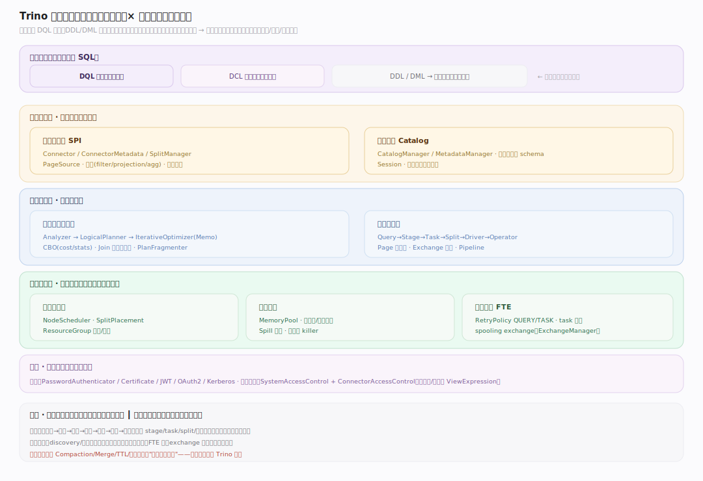
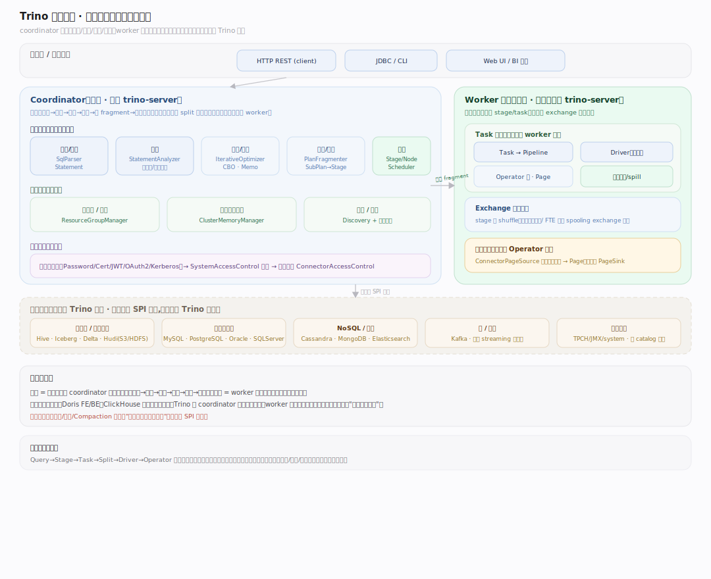
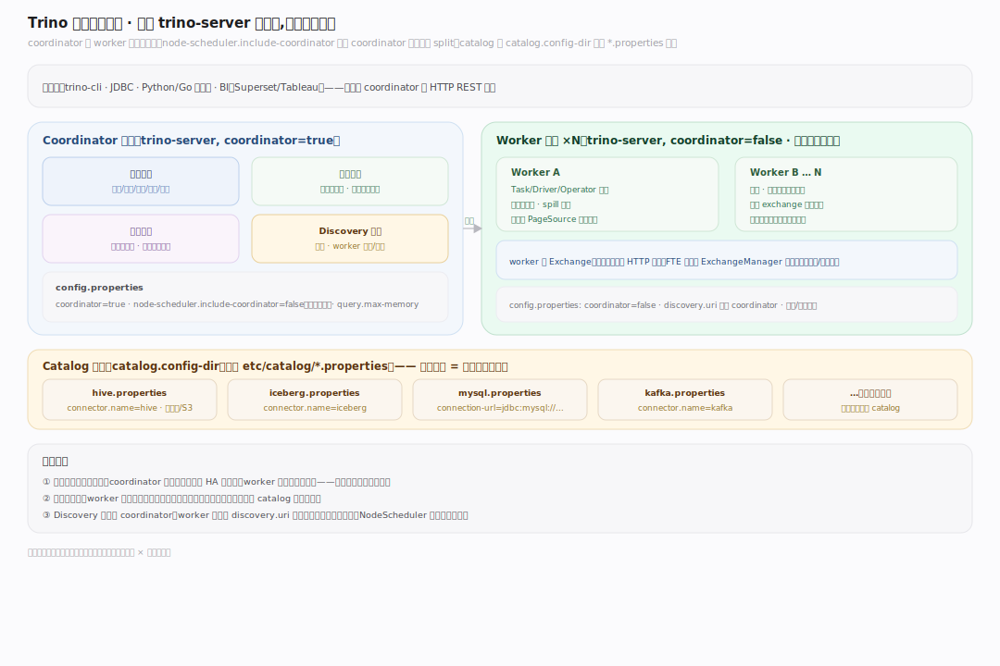
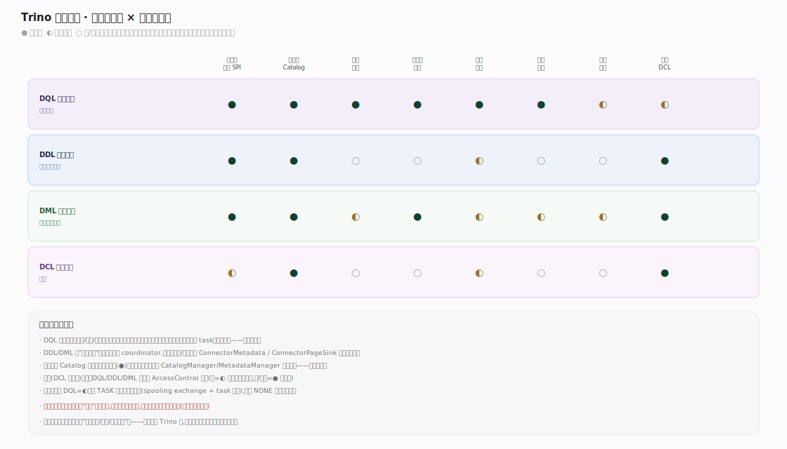
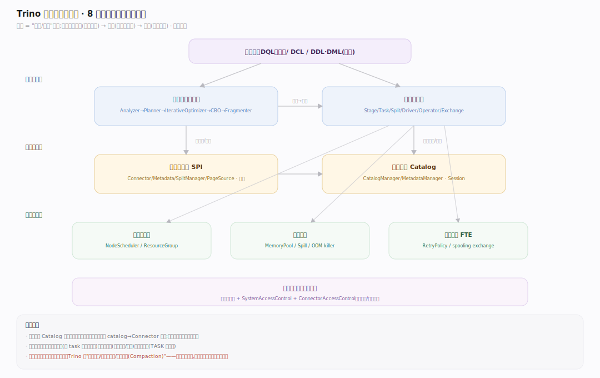

# Trino 原理 · 全景主线框架

> **定位**：本篇是全库的地图与总纲。用"双维模型"把所有主线归位（能力域 × 执行时机），给出总架构图、物理部署视图、`接触面 × 能力域` 依赖矩阵，并声明 Trino 区别于存算一体引擎的三条贯穿性事实。**读全库从这里开始，遇到"某能力属于哪条主线"的疑问回这里查依赖矩阵。**

Trino 是**联邦查询引擎**（原型 B）：SQL 为主接口、**自身不管理持久存储**，数据留在外部数据源（Hive/Iceberg/MySQL/Kafka…），引擎是一套无中心存储的 **coordinator–worker 纯计算集群 + 连接器（Connector）读写外部源**。这一句决定了它的全部主线取法：没有存储引擎/事务/Compaction 这些存算一体主题，取而代之的是**连接器框架、分布式执行、调度与资源、内存与容错**。

---

## 一、核心差异：Trino 不是什么（三条贯穿声明）

理解 Trino 前，先立三条"它不做什么"——它们贯穿每一条主线，是与 Doris/ClickHouse 这类存算一体引擎的根本分野：

1. **无自有存储。** Trino 不存数据、不管副本、无 Compaction、无 MVCC 版本链。表的字节由**连接器**从外部源（对象存储上的 Parquet/ORC、关系库、消息队列）读出，落库也下推给连接器。引擎只持有查询期的中间态。
2. **无持久元数据。** 没有常驻的元数据服务或 EditLog。库表 schema、统计信息**每次查询经连接器 `ConnectorMetadata` 现取**；集群自身只有内存态的会话/查询状态。
3. **纯 MPP 计算，查询即生命周期。** 所有资源（stage/task/split/内存）随一条查询而生、随查询结束而灭。集群守护进程只做调度、资源组、内存仲裁，不做后台数据维护。

> 记忆锚点：**Trino = "SQL 计算层" + "连接器数据层"**，两层之间是 SPI 契约。存算一体引擎把这两层焊死在一起，Trino 把它们解耦，因此能"一套 SQL 查遍所有源"。

---

## 二、双维模型：能力域 × 执行时机

Trino 的主线按"归属能力域"归位，再按"执行时机"分前台查询期 / 集群守护：

- **接触面（用户下发）**：DQL 数据查询（主）· DCL 安全控制 ·（DDL/DML 多下推连接器，作旁支）。
- **底座能力域**：连接器框架 SPI（数据入口）· 元数据与 Catalog（schema/统计/会话）。
- **计算能力域**：查询规划与优化（分析→逻辑计划→CBO→分布式化）· 分布式执行（Stage/Task/Split/Driver/Operator/Exchange）。
- **保障能力域**：调度与资源（coordinator 调度、node scheduler、资源组）· 内存管理（memory pool、spill）· 容错执行（FTE、重试、spooling exchange）。
- **贯穿**：安全（认证 + 系统级/连接器级访问控制），横切所有主线。

---

## 三、总架构图（位置即语义）

一条查询在集群里的位置即语义：客户端 → **coordinator**（解析/分析/规划/优化/调度）→ 分发 fragment 到 **worker** 集群（并行执行 stage/task）→ worker 经 **连接器** 读外部源、彼此经 **exchange** 交换数据 → 汇聚回 coordinator → 返回客户端。coordinator 与 worker 都是同一个 `trino-server` 进程，靠配置区分角色。

---

## 四、物理部署视图

---

## 五、接触面 × 能力域 依赖矩阵

矩阵是三角一致性的仲裁表：每条接触面主线声称依赖某能力域，必须能在此矩阵与被依赖主线的正文同时对上。

---

## 六、能力域依赖关系

---

## 一句话总纲

**Trino 是一套无自有存储的 coordinator–worker MPP 计算集群：SQL 经 coordinator 分析→逻辑计划→CBO 优化→切成 fragment，分发到 worker 以 Stage/Task/Split/Driver/Operator 层次并行执行，数据经连接器 SPI 从外部源以 Page 读出、stage 间经 exchange 交换，全部资源随查询生灭——用"一套 SQL 查遍所有源"换掉了存储/事务/后台维护。**
