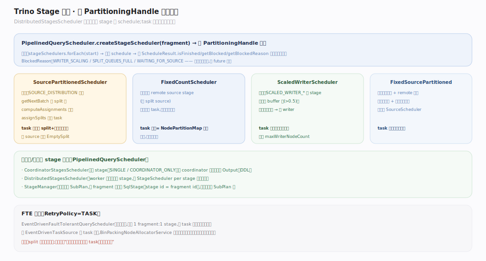
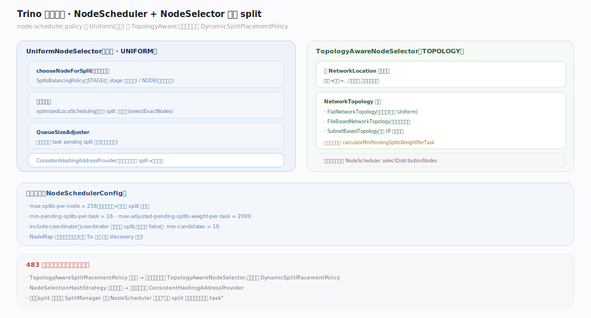
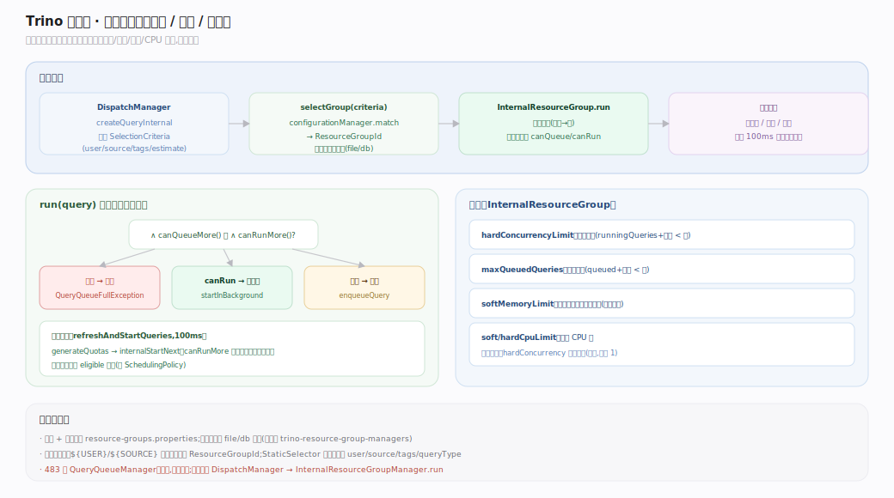
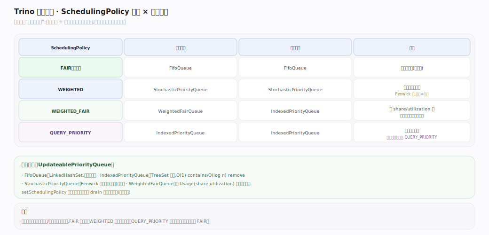

# Trino 原理 · 支撑主线 · 调度与资源

> **定位**：属"保障能力域"。管两件事：① 一条查询的 stage/task/split **调度**到哪些 worker、按什么策略放置；② 多查询并发时的**资源治理**（准入、排队、并发/内存/CPU 限额）。被【分布式执行】依赖（要 task 放哪、几个），依赖【元数据】拿节点存活视图。源码基准 **Trino 483-SNAPSHOT**。

调度分两层：**stage 调度**（每 stage 起多少 task、split 怎么分给 task）与 **节点选择**（task/split 落到哪个 worker）。资源治理由**资源组**（ResourceGroup）承担：查询进来先经准入判定，允许则跑、否则排队或拒绝。

---

## 一、Stage 调度：每 stage 起多少 task

`PipelinedQueryScheduler` 的 `DistributedStagesScheduler` 循环驱动每个 stage 的 `StageScheduler.schedule`。**调度器按 fragment 的 `PartitioningHandle` 选择**（`createStageScheduler`）：

- `SOURCE_DISTRIBUTION` + 单源 → `SourcePartitionedScheduler`：拉 split 批、分配、task 数随 split/节点动态增长。
- 全 remote source → `FixedCountScheduler`：task 数 = `NodePartitionMap` 大小（固定）。
- `SCALED_WRITER_*` → `ScaledWriterScheduler`：随输出数据量动态加 writer task。
- 混合 → `FixedSourcePartitionedScheduler`。

`ScheduleResult` 携带 `finished`/`newTasks`/`blocked` future + `BlockedReason`（`WRITER_SCALING`/`SPLIT_QUEUES_FULL`/`WAITING_FOR_SOURCE`）——调度器不阻塞，靠 future 驱动。

---

## 二、节点选择：split/task 落到哪个 worker

`NodeScheduler.createNodeSelector` 产出选择器，按 `node-scheduler.policy` 分两种：

- **`UniformNodeSelector`（默认）**：按 `SplitsBalancingPolicy`（STAGE=按本 stage 排队权重 / NODE=按节点总权重）选最闲节点；`optimizedLocalScheduling` 时优先 split 偏好地址（数据本地性）；`QueueSizeAdjuster` 自适应扩每 task pending 队列。
- **`TopologyAwareNodeSelector`**：按 `NetworkLocation` 逐层（机架→…）分配，减跨机架传输；拓扑来自 `Flat`/`FileBased`/`Subnet` 三种 `NetworkTopology`。

关键限额（`NodeSchedulerConfig`）：`max-splits-per-node`=256、`min-pending-splits-per-task`=16、`include-coordinator`、`min-candidates`=10。`DynamicSplitPlacementPolicy` 是唯一放置策略（旧 `TopologyAwareSplitPlacementPolicy` 已移除，拓扑感知内化进选择器）。

---

## 三、资源组：准入、排队、限额

查询准入路径：`DispatchManager.createQueryInternal` 构建 `SelectionCriteria`（user/source/tags…）→ `resourceGroupManager.selectGroup` 匹配到 `ResourceGroupId` → `InternalResourceGroup.run(query)` 做**准入判定**：

- 自底向上（本组→根）检查每个祖先的 `canQueueMore` 与 `canRunMore`。
- `!canQueue && !canRun` → **拒绝**（`QueryQueueFullException`）；`canRun` → **立即跑**；否则 → **排队**。
- 后台 100ms 刷新 `internalStartNext`：`canRunMore` 时从队列取下一个查询启动。

限额（`InternalResourceGroup`）：`hardConcurrencyLimit`（并发上限）、`maxQueuedQueries`（队列上限）、`softMemoryLimit`（超过则停新启动）、`hard/softCpuLimit`（软硬 CPU 限，之间线性收缩并发）。

---

## 深化 · 调度策略与排队实现

资源组的 `SchedulingPolicy` 决定组内"下一个跑谁"（子组队列 + 查询队列）：

| 策略 | 子组队列 | 查询队列 | 语义 |
|---|---|---|---|
| `FAIR` | FifoQueue | FifoQueue | 先到先服务（默认） |
| `WEIGHTED` | StochasticPriorityQueue | 同 | 按权重随机（Fenwick 树抽签） |
| `WEIGHTED_FAIR` | WeightedFairQueue | IndexedPriorityQueue | 按 share/utilization 比公平 |
| `QUERY_PRIORITY` | IndexedPriorityQueue | 同 | 按查询优先级 |

切换策略时会把旧队列的条目迁移进新队列类型。

## 调优要点（关键开关）

- `query.max-concurrent-queries` / 资源组 `hardConcurrencyLimit` / `maxQueued`。
- `node-scheduler.policy`（UNIFORM/TOPOLOGY）、`node-scheduler.max-splits-per-node`、`node-scheduler.include-coordinator`。
- `resource-groups.properties` / `resource-groups.configuration-manager`（file/db）——定义组树、选择器、限额。
- `query.low-memory-killer.policy`（与内存管理协同）。

## 常见误区与工程要点

- **误区：调度器叫 `SqlQueryScheduler`。** 不存在（见 DQL 篇）。接口是 `QueryScheduler`，Pipelined/FTE 两实现。
- **误区：split 由调度器生成。** 不是。split 由连接器 `SplitManager` 生成（见【连接器框架】），调度只负责放置。
- **误区：资源组选择器在 core。** 在插件 `trino-resource-group-managers`（file/db 两种配置管理器），不在 core。
- **误区：还有 `TopologyAwareSplitPlacementPolicy` / `QueryQueueManager`。** 483 已移除；放置只剩 `DynamicSplitPlacementPolicy`，准入走 `DispatchManager`→`InternalResourceGroupManager`。
- **归属提醒**：内存 OOM killer 在【内存管理】篇；本篇的资源组只管准入/并发/CPU，内存软限只作准入门槛之一。

## 一句话总纲

**调度与资源分两层：Stage 调度按 fragment 的 PartitioningHandle 选调度器（Source 动态 / FixedCount 固定 / ScaledWriter 增长）定每 stage 的 task 数，NodeScheduler 的选择器（默认 Uniform 选最闲、可选 TopologyAware 机架感知）把 split 放到 worker；资源组则在查询入口做准入判定——按祖先链的并发/队列/内存/CPU 限额决定立即跑、排队还是拒绝，组内按 SchedulingPolicy(FAIR/WEIGHTED/…) 选下一个。**
