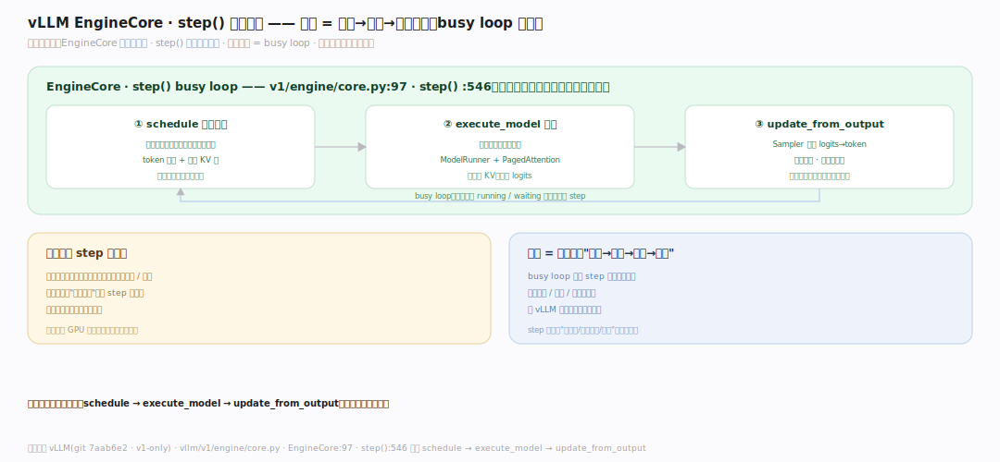
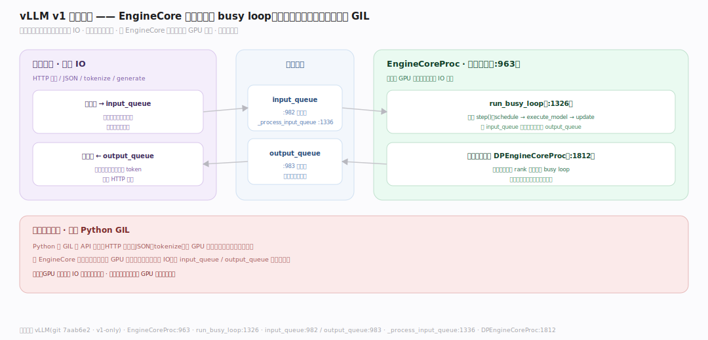
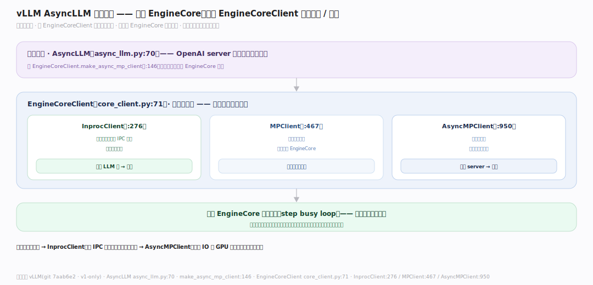

# vLLM 原理 · 支撑主线 · EngineCore 执行循环

> **定位**：属"引擎能力域"——vLLM 的心脏。管推理主循环:EngineCore 的 step()(调度→前向→输出)busy loop,并可拆到独立进程(AsyncLLM/MPClient)与 API 前端异步通信。是串起调度/执行/采样的驱动器。调用【连续批处理】选批、【采样】出 token。源码基准 **vLLM(git 7aab6e2)**(`vllm/v1/engine/core.py`)。

调度选好批、模型跑前向、采样出 token——谁把这些串成一个不停转的循环?**EngineCore**。它的 `step()` = 调度一批 → 交给执行器跑模型 → 处理输出(采样、检查停止、回填);busy loop 反复 step 直到没请求。v1 的关键设计:把 EngineCore 拆到**独立进程**,API 前端(FastAPI/AsyncLLM)通过队列异步喂请求/取结果——前端处理 HTTP 不阻塞 GPU 循环。理解"step 循环 + 进程拆分",就懂了 vLLM 的执行骨架。

---

## 一、EngineCore.step():一步推理

**EngineCore**(`vllm/v1/engine/core.py:97`)的核心是 `step()`(:546):

- 一步三件事:① **schedule** 调度一批请求(见【连续批处理】)② **execute_model** 交执行器跑模型前向 ③ **update_from_output** 处理输出(采样结果回填请求、判停止、完成的出队)。
- busy loop 反复 step——只要还有 running/waiting 请求就继续。
- 每步都是一个完整的"选批→前向→采样→回填"循环。

**为什么 step 粒度**:连续批处理要求每步都能重组批、处理完成/新到的请求;把"一次前向"作为 step 单元,循环在每步边界重新调度——这个粒度既让 GPU 每步满载,又让请求能随时进出。

---

## 二、独立进程:EngineCoreProc + 队列

v1 把 EngineCore 拆到独立进程:

- `EngineCoreProc`(:963):在**单独进程**跑 EngineCore 的 busy loop(`run_busy_loop` :1326)。
- 通信队列:`input_queue`(:982,收请求)、`output_queue`(:983,发结果);`_process_input_queue`(:1336)取入队请求。
- 数据并行变体 `DPEngineCoreProc`(:1812)。
- 前端(HTTP/generate)把请求塞 input_queue、从 output_queue 取结果——与 GPU 循环解耦。

**为什么拆进程**:Python 的 GIL 让 API 服务(HTTP 解析、JSON、tokenize)和 GPU 调度在同进程会互相阻塞;把 EngineCore 放独立进程专心跑 GPU 循环,前端进程处理 IO,经队列异步通信——GPU 不被前端 IO 拖慢,吞吐更稳。

---

## 三、AsyncLLM 与客户端

前端如何接 EngineCore:

- `AsyncLLM`(`vllm/v1/engine/async_llm.py:70`):异步引擎接口(OpenAI server 用它),经 `EngineCoreClient.make_async_mp_client`(:146)建客户端连到 EngineCore 进程。
- `EngineCoreClient`(`vllm/v1/engine/core_client.py:71`)抽象:`InprocClient`(:276,同进程,离线简单场景)、`MPClient`(:467,多进程)、`AsyncMPClient`(:950,异步多进程,在线服务)。
- 离线 `LLM` 类可用 InprocClient(同进程直调);在线 server 用 AsyncMPClient(跨进程异步)。

**为什么多种客户端**:场景不同——离线批量图省事用同进程(InprocClient 直接调,无 IPC 开销);在线高并发要前端不阻塞用异步多进程(AsyncMPClient)。同一 EngineCore 通过不同客户端适配离线/在线,复用核心循环。

---

## 拓展 · EngineCore 关键一览

| 项 | 定义 | 职责 |
|---|---|---|
| EngineCore | `v1/engine/core.py:97` | 推理核心 |
| step() | `:546` | 一步:调度→前向→输出 |
| EngineCoreProc | `:963` | 独立进程 busy loop |
| input/output_queue | `:982` / `:983` | 请求/结果队列 |
| AsyncLLM | `async_llm.py:70` | 异步引擎(在线) |
| EngineCoreClient | `core_client.py:71` | Inproc/MP/AsyncMP 客户端 |

## 调优要点（理解要点）

- **在线用 AsyncMPClient**:高并发服务让前端 IO 与 GPU 循环分进程,吞吐稳。
- **离线用 InprocClient**:批量离线无需 IPC,同进程直调更简单。
- **step 是调度边界**:所有"每步重组批/前缀命中/抢占"都发生在 step 的 schedule 环节。
- **进程通信开销**:多进程有 IPC 序列化成本;离线小场景同进程反而快。

## 常见误区与工程要点

- **误区:EngineCore 和 API 在同线程。** v1 常把 EngineCore 拆独立进程,经队列异步通信,避开 GIL 阻塞。
- **误区:step 只做前向。** step=调度+前向+采样回填一整轮;是连续批处理的循环单元。
- **误区:只有一种客户端。** Inproc(离线)/MP/AsyncMP(在线)按场景选;同一 EngineCore 复用。
- **误区:v1 还有 v0 的复杂引擎分层。** v0 已删;`vllm/engine/` 只是转发到 v1 的兼容壳(llm_engine.py:3 别名)。
- **归属提醒**:step 里的选批在【连续批处理】;前向用【PagedAttention】的 KV;输出的 logits 交【采样】;多卡前向在【分布式并行】;入口 AsyncLLM 被【接触面】的 server 使用。

## 一句话总纲

**vLLM 的心脏 EngineCore(v1/engine/core.py:97):step()(:546)一步=schedule 选批→execute_model 跑前向→update_from_output 采样回填判停,busy loop 反复 step 串起调度/执行/采样;v1 把它拆到独立进程 EngineCoreProc(:963,run_busy_loop:1326)经 input_queue(:982)/output_queue(:983)与前端异步通信——避开 Python GIL 让 GPU 循环不被前端 IO 阻塞;AsyncLLM(async_llm.py:70)+ EngineCoreClient(InprocClient 离线同进程 / AsyncMPClient 在线异步多进程)按场景适配;v0 已删,vllm/engine/ 只是转发到 v1 的兼容壳。**
