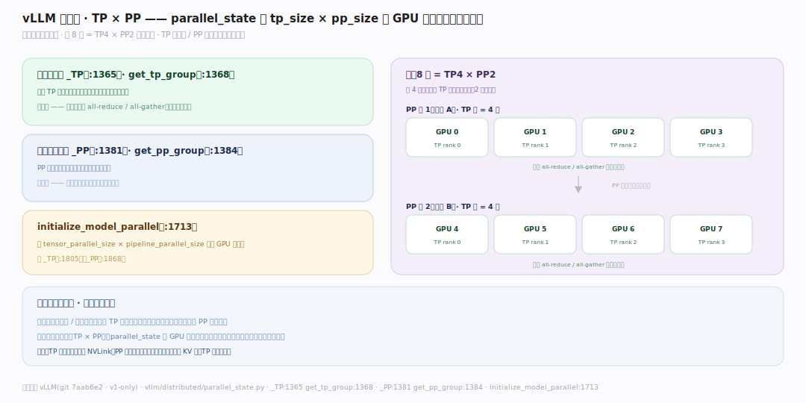
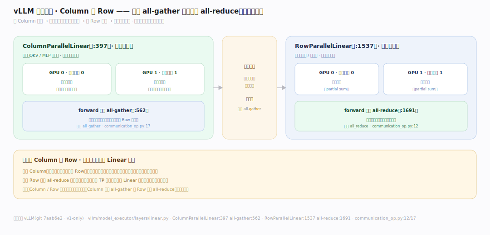
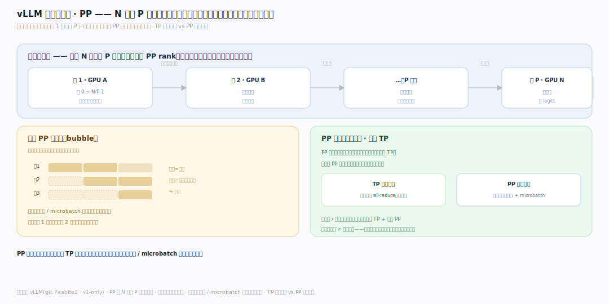

# vLLM 原理 · 支撑主线 · 分布式并行（TP/PP）

> **定位**：属"扩展能力域"——让大模型跑在多卡/多机。管并行:张量并行(TP,一层切到多卡)+ 流水线并行(PP,不同层放不同卡);parallel_state 维护通信组,并行 Linear 层做 all-reduce/all-gather。是超大模型的必需。切分【PagedAttention】的 KV 到多卡。源码基准 **vLLM(git 7aab6e2)**(`vllm/distributed/parallel_state.py`)。

一张 GPU 装不下的大模型(如 70B)怎么跑?**并行切分**。两种主要方式:**张量并行(TP)**——把一层(如大矩阵乘)横切到多卡,每卡算一部分再聚合;**流水线并行(PP)**——把模型的层分段放到不同卡,数据像流水线流过。vLLM 用 `parallel_state` 维护 TP/PP 通信组,并行 Linear 层(Column/Row Parallel)在前向里插 all-gather/all-reduce 通信。理解"TP 切层内 + PP 切层间 + 通信原语",就懂了 vLLM 怎么扩到多卡。

---

## 一、通信组:TP × PP

**parallel_state**(`vllm/distributed/parallel_state.py`)维护并行组:

- **张量并行组** `_TP`(:1365),`get_tp_group`(:1368)——同一 TP 组的卡协作算一层。
- **流水线并行组** `_PP`(:1381),`get_pp_group`(:1384)——PP 组的卡按层段接力。
- `initialize_model_parallel`(:1713):初始化时按配置(tensor_parallel_size × pipeline_parallel_size)划分 GPU 到各组(设 `_TP` :1805、`_PP` :1868)。
- 例:8 卡 = TP4 × PP2——每 4 卡组成一个 TP 组算一段的层,2 段流水线。

**为什么分两种组**:TP 和 PP 解决不同瓶颈——单层太大(参数/激活放不下)用 TP 切层内;层数太多(总参数放不下)用 PP 切层间;两者正交可组合(TP×PP)。parallel_state 把 GPU 拓扑组织成这两类通信组,各自用不同集合通信。

---

## 二、张量并行:Column / Row Parallel Linear

TP 靠**并行 Linear 层**(`vllm/model_executor/layers/linear.py`)实现:

- **ColumnParallelLinear**(:397):权重按**列**切到各卡,每卡算部分输出;forward 末尾 **all-gather**(:562)拼回完整输出。
- **RowParallelLinear**(:1537):权重按**行**切,每卡算部分和;forward 末尾 **all-reduce**(:1691)求和得完整结果。
- 典型:Transformer 的 QKV/MLP 上投影用 Column(切列)、输出/下投影用 Row(切行)——两者配对,中间免通信,只在边界通信一次。
- 通信原语:`tensor_model_parallel_all_reduce`(`communication_op.py:12`)、`all_gather`(:17)。

**为什么 Column 配 Row**:一个 Column(输出切列)后接一个 Row(输入切行),中间的激活天然按同样方式切分、无需通信;只在 Row 末尾 all-reduce 一次合并。这种成对设计把 TP 通信降到每对 Linear 一次,而非每步都通信——最小化昂贵的跨卡通信。

---

## 三、流水线并行:层分段接力

PP 把模型层**分段**放不同卡:

- 模型的 N 层切成 P 段,每段放一个 PP rank(卡);数据前向时从第一段流到最后一段(层间传激活)。
- 只在段边界传递激活(点对点通信,比 TP 的集合通信少)。
- 配合连续批处理/microbatch 让各段流水线并行(段 1 算下一批时段 2 算上一批)减少气泡。

**为什么 PP 通信少但有气泡**:PP 只在段边界传激活(点对点),通信量远小于 TP;但朴素 PP 有"气泡"(前几段算时后几段空等);vLLM 结合连续批处理让不同请求填满流水线各段,减少空等。TP 通信重但无气泡、PP 通信轻但需填流水线——按模型/硬件权衡组合。

---

## 拓展 · 分布式并行关键一览

| 项 | 定义 | 职责 |
|---|---|---|
| _TP / get_tp_group | `parallel_state.py:1365/1368` | 张量并行组 |
| _PP / get_pp_group | `:1381/1384` | 流水线并行组 |
| initialize_model_parallel | `:1713` | 划分 GPU 到组 |
| ColumnParallelLinear | `layers/linear.py:397` | 切列 + all-gather |
| RowParallelLinear | `:1537` | 切行 + all-reduce |
| all_reduce / all_gather | `communication_op.py:12/17` | 集合通信原语 |

## 调优要点（理解要点）

- **TP 优先单机内**:TP 通信重(每对 Linear all-reduce),放单机内高带宽 NVLink;跨机 TP 慢。
- **PP 跨机**:PP 通信轻(点对点传激活),适合跨机扩展;配 microbatch 减气泡。
- **TP×PP 组合**:超大模型单机 TP + 多机 PP;按模型大小和网络拓扑选 tp_size×pp_size。
- **KV 也随之切分**:每卡只存自己那份 KV 块(TP 下按头切);块管理是每卡独立的。

## 常见误区与工程要点

- **误区:TP 和 PP 一回事。** TP 切层内(all-reduce/all-gather,通信重无气泡)、PP 切层间(点对点,通信轻有气泡);正交可组合。
- **误区:Column/Row 随便用。** Column(切列 all-gather)配 Row(切行 all-reduce)成对,中间免通信;顺序有讲究。
- **误区:多卡=线性加速。** 通信开销、气泡、负载不均使加速次线性;TP 尤其受带宽限制。
- **误区:KV 缓存全卡共享一份。** TP 下每卡存自己负责的头的 KV;块池是每卡独立的。
- **归属提醒**:并行切的是【PagedAttention】的 KV 和模型权重;通信发生在【EngineCore】前向中;每卡独立【块管理】的块池;并行度由【接触面】的启动参数(tp_size/pp_size)定。

## 一句话总纲

**vLLM 多卡扩展靠并行:parallel_state.py 维护张量并行组 _TP(:1365,get_tp_group)+ 流水线并行组 _PP(:1381),initialize_model_parallel(:1713)按 tp_size×pp_size 划分 GPU;张量并行(TP)切层内——ColumnParallelLinear(linear.py:397 切列+all-gather:562)配 RowParallelLinear(:1537 切行+all-reduce:1691)成对,中间免通信只边界通信一次(原语 communication_op.py:12/17);流水线并行(PP)切层间——层分段放不同卡点对点传激活,通信轻但有气泡,配连续批处理/microbatch 填流水线;TP 重无气泡宜单机 NVLink、PP 轻宜跨机,可 TP×PP 组合,每卡独立存自己那份 KV 块。**
