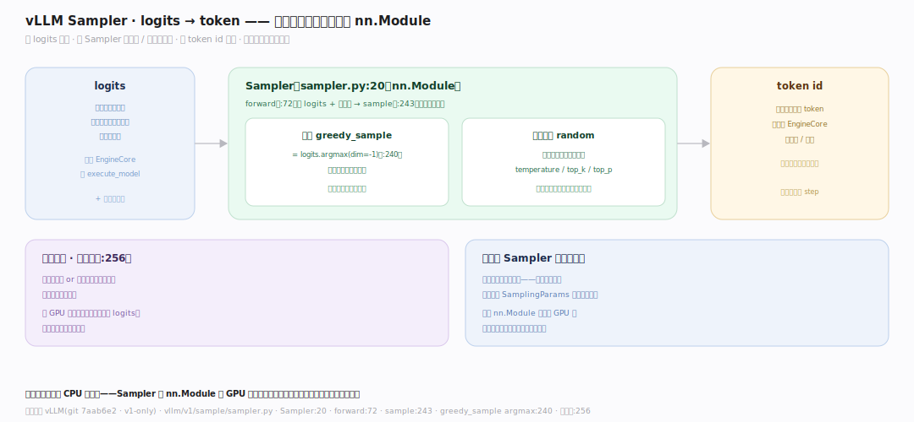
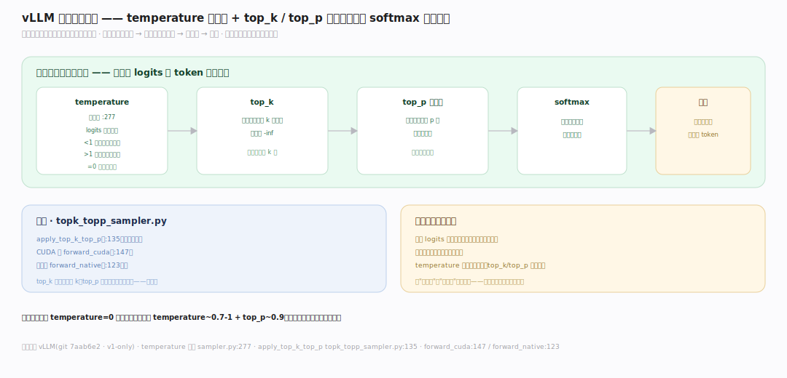
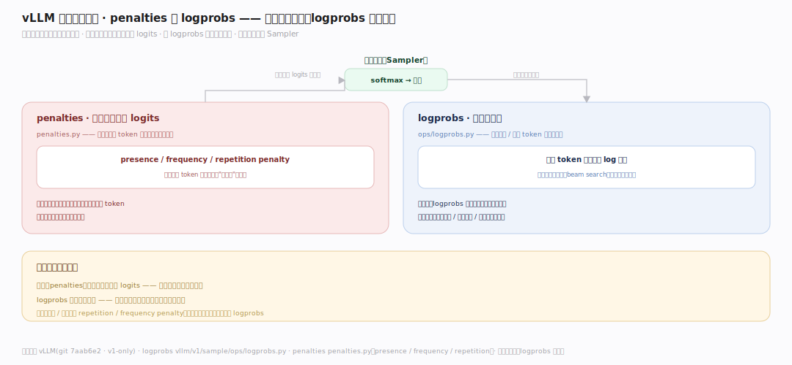

# vLLM 原理 · 支撑主线 · 采样

> **定位**：属"生成能力域"——把模型输出变成 token。管采样:模型前向出 logits(每个词的分数),Sampler 按 SamplingParams(贪心/随机 + temperature/top_p/top_k)采出下一个 token id。是每步生成的最后一环。用【接触面】的 SamplingParams、给【EngineCore】回填 token。源码基准 **vLLM(git 7aab6e2)**(`vllm/v1/sample/sampler.py`)。

模型前向的输出是 **logits**——词表上每个词的分数(未归一)。怎么从这堆分数选出"下一个 token"?**Sampler** 干这事:贪心(取分最高)还是随机采样?随机的话先用 temperature 调分布陡峭度、top_p/top_k 截断候选,再按概率抽。理解"logits→采样策略→token id",就懂了 vLLM 生成的最后一步。

---

## 一、Sampler:logits 到 token

**Sampler**(`vllm/v1/sample/sampler.py:20`,是个 `nn.Module`)把 logits 变 token:

- `forward`(:72):接收模型输出的 logits + 采样元数据,返回采出的 token id。
- `sample`(:243):核心采样逻辑。
- **贪心**:`greedy_sample` = `logits.argmax(dim=-1)`(:240)——直接取分数最高的词(确定性)。
- **分支优化**:整批全贪心 or 全随机时走快路径(:256);混合时分别处理。

**为什么 Sampler 是独立模块**:采样与模型前向解耦——同一模型输出可按不同 SamplingParams 采不同结果;把采样做成 nn.Module 便于在 GPU 上批量处理一批请求的 logits(每个请求参数可不同)。

---

## 二、温度与截断:temperature / top_p / top_k

随机采样前先整形分布:

- **temperature**(应用于 :277):logits 除以温度——温度 <1 分布变陡(更确定)、>1 变平(更随机)、=0 退化为贪心。
- **top_k**:只保留分数前 k 的候选,其余置 -inf。
- **top_p(核采样)**:按概率累加到 p 的最小候选集,截断长尾。
- 实现:`topk_topp_sampler.py`——`apply_top_k_top_p`(:135),CUDA 版 `forward_cuda`(:147)/原生 `forward_native`(:123)。
- 整形后 softmax 成概率,按概率随机抽一个 token。

**为什么先整形再抽**:原始 logits 长尾里有大量低概率词,直接按全分布抽会偶尔蹦出离谱词;temperature 调整体随机度、top_k/top_p 砍掉不合理长尾——在"多样性"和"合理性"间取平衡,是控制生成质量的核心旋钮。

---

## 三、logprobs 与惩罚

采样的附加能力:

- **logprobs**(`vllm/v1/sample/ops/logprobs.py`):返回所选 token(及候选)的对数概率——用于置信度分析、beam search、评测。
- **惩罚**(`penalties.py`):presence/frequency/repetition penalty——对已出现的 token 降分,抑制重复啰嗦。
- 这些在采样前作用于 logits(惩罚)或采样后提取(logprobs)。

**为什么要惩罚和 logprobs**:纯采样易重复("的的的")——惩罚项对已生成 token 减分打破循环;logprobs 让调用方知道模型对每个选择多有把握(评测/可解释性/推测解码都需要)。

---

## 拓展 · 采样关键一览

| 项 | 定义 | 职责 |
|---|---|---|
| Sampler | `sampler.py:20` | logits→token |
| greedy_sample | `:240` | argmax 贪心 |
| temperature | 应用 `:277` | 调分布陡峭度 |
| apply_top_k_top_p | `ops/topk_topp_sampler.py:135` | 截断候选 |
| logprobs / penalties | `ops/` | 对数概率 / 重复惩罚 |

## 调优要点（理解要点）

- **确定性用 temperature=0**:走贪心,结果可复现;适合代码/抽取。
- **多样性调 temperature + top_p**:创意任务 temperature~0.7-1 + top_p~0.9;平衡随机与合理。
- **抑制重复**:啰嗦/循环时加 repetition/frequency penalty。
- **可复现随机**:要随机又要复现用 RANDOM_SEED(固定种子)。

## 常见误区与工程要点

- **误区:temperature 越高越好。** 过高蹦离谱词、过低太死板;按任务在 0(确定)~1+(创意)间调。
- **误区:top_k 和 top_p 一样。** top_k 固定保留前 k 个;top_p 按累积概率动态截断长尾;可组合。
- **误区:采样是 CPU 后处理。** Sampler 是 nn.Module 在 GPU 上批量处理一批 logits;高效并行。
- **误区:贪心一定最优。** 贪心每步取最高但可能全局非最优/重复;采样带随机反而更自然。
- **归属提醒**:采样参数来自【接触面】的 SamplingParams;输入 logits 是【EngineCore】前向的输出;采出的 token 回填给【EngineCore】判停止/继续;多卡下 logits 可能需先聚合(见【分布式并行】)。

## 一句话总纲

**vLLM 采样把 logits 变 token:Sampler(sampler.py:20,nn.Module)的 forward(:72)/sample(:243)——贪心 greedy_sample=argmax(:240 确定性)或随机采样;随机前整形分布:temperature(:277 除温度调陡峭度,0=贪心)+ top_k(留前 k)+ top_p 核采样(累积概率截断长尾,apply_top_k_top_p ops/topk_topp_sampler.py:135)再 softmax 按概率抽;附加 logprobs(对数概率,评测/推测解码)+ penalties(presence/frequency/repetition 抑制重复);在 GPU 上批量处理一批请求各自参数——是每步生成的最后一环,回填给 EngineCore 判停止。**
