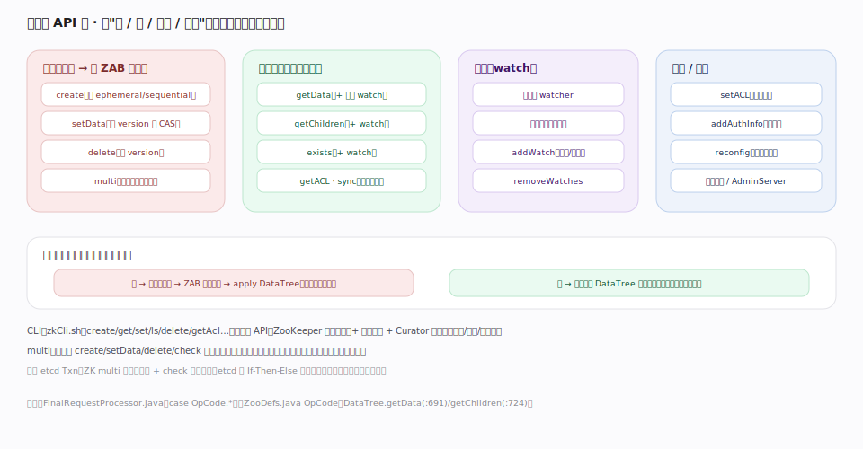
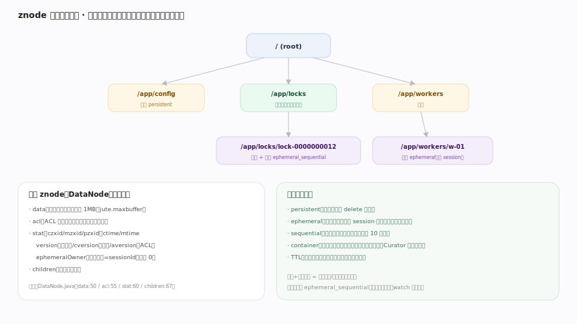
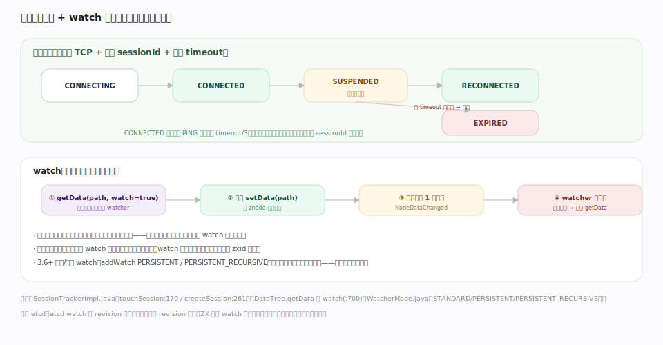

# ZooKeeper 原理 · 接触面主线 · 客户端 API 与 znode

> **定位**：客户端 API 与 znode 是 ZooKeeper 的**接触面**——用户下发一切操作的入口（对应 SQL 引擎的"语句族"、etcd 的"gRPC API 族"）。骨架 = `一族 API（create/getData/setData/getChildren/exists/delete/multi + watch + session）操作一棵层级 znode 树 → 服务端按读/写分流`。它是所有支撑主线的汇聚点：写→[[ZAB 原子广播]]、读→[[数据树 DataTree]]、订阅→[[Watch 机制]]、临时节点→[[会话与临时节点]]、权限→[[ACL 权限]]。核实基准：`server/FinalRequestProcessor.java`、`ZooDefs.java`、`server/DataTree.java`（3.10.0-SNAPSHOT）。

## 一、API 族：按"写 / 读 / 订阅 / 管理"分组

ZooKeeper 的 API 面很小、语义极简——刻意如此（"少而正交的原语，组合出复杂协调"）：

- **写**（改数据，必经 ZAB 全序）：`create`（可带 ephemeral/sequential/container/ttl 标志）、`setData`、`delete`、`multi`（多操作原子事务）。写请求都会被 `PrepRequestProcessor` 转成事务、`Leader.propose` 广播。
- **读**（直查本地内存树）：`getData`、`getChildren`、`exists`、`getACL`；`sync` 强制本节点追平 leader 再读（拿最新）。读默认不经共识，故可被任意 follower/observer 服务。
- **订阅**：读操作可附带 `watch=true` 注册一次性 watcher；`addWatch` 注册持久/递归 watch；`removeWatches` 移除。
- **管理 / 连接**：`setACL`、`addAuthInfo`（提交认证凭据）、`reconfig`（动态成员变更）、四字命令 / AdminServer（运维查询）。

## 二、znode：层级命名空间

ZooKeeper 的数据模型是一棵**类文件系统的路径树**：每个路径对应一个 **znode**，znode **既能存数据（字节数组）又能有子节点**（不同于纯文件系统的"文件 xor 目录"）。一个 znode（`DataNode`，`DataNode.java:40`）含 `data`（`:50`）、`acl` 引用（`:55`）、`stat`（`:60`，含 czxid/mzxid/pzxid、各类 version、`ephemeralOwner`）、`children`（`:67`）。

**五种节点类型**决定生命周期：`persistent`（持久）、`ephemeral`（临时，绑 session）、`sequential`（顺序，父节点分配单调递增 10 位后缀）、`container`（容器，空了被后台回收）、`ttl`（超时回收）。经典配方：`ephemeral + sequential` = 分布式锁 / 选主（各竞争者建顺序临时节点、最小号得锁、watch 前一个）。

## 三、会话与 watch：客户端视角

**会话（session）**是客户端与集群的逻辑连接：一次握手分得一个全局 `sessionId` + 协商的 `timeout`，之后即使底层 TCP 断连重连（可换到集群另一台服务器）会话仍延续，直到超 `timeout` 未心跳才 EXPIRED。CONNECTED 时客户端定期发 PING 心跳（约 `timeout/3`）。会话是 ephemeral 节点与 watch 的宿主：会话过期 → 其 ephemeral 节点全删、注册的 watch 全清。

**watch（标准模式）是一次性的**：读时挂 watcher → 目标 znode 变更 → 服务端推**恰好一个**事件 → watcher 随即失效，想继续监听必须重新注册。设计动机是避免服务端为海量长期订阅保持状态。3.6+ 引入持久/递归 watch（`addWatch`）补足这一语义。

## 深化 · 顺序保证与客户端库

ZooKeeper 对单客户端提供强顺序保证：**① 写的全局有序**（所有写按 zxid 线性化，所有客户端看到相同顺序）；**② 客户端 FIFO**（同一 client 的请求按发送顺序执行）；**③ watch 与数据视图有序**（先收到 watch 事件、再看到对应之后的读结果）。编程上有同步 API（`ZooKeeper` 类）与异步回调；生产普遍用 **Apache Curator** 封装重连、`ephemeral_sequential` 锁、leader 选举、路径缓存等 recipe，避免自己处理 watch 重挂与会话恢复的边界。

## 拓展 · API 与归属能力域

| API | 路径 | 归属能力域 |
|---|---|---|
| create / setData / delete / multi | 写 → 处理链 → ZAB → DataTree | [[ZAB 原子广播]] + [[数据树 DataTree]] |
| getData / getChildren / exists | 读 → 本地内存树 | [[数据树 DataTree]] |
| watch（读时挂） / addWatch | 注册 → WatchManager | [[Watch 机制]] |
| create ephemeral / 心跳 | 绑 session / touchSession | [[会话与临时节点]] |
| getACL / setACL / addAuthInfo | checkACL / auth provider | [[ACL 权限]] |
| reconfig | 成员变更事务 | [[集群与 Quorum]] |
| sync | 强制追平 leader 再读 | [[ZAB 原子广播]] |

## 调优要点（关键开关）

- `jute.maxbuffer`：单个请求/znode 数据上限（默认约 1MB）——ZK 存小数据，大 value 会撑大内存树与日志。
- `tickTime` + `minSessionTimeout`/`maxSessionTimeout`：会话超时被夹在 [2×tick, 20×tick]，决定故障检测灵敏度。
- 读用就近 follower/observer 扩展吞吐；要强一致读用 `sync` + read（付一次共识开销）。
- `multi` 而非多次单独写：需原子/多节点一致时用 multi，别用"多次读改写"（有竞态）。

## 常见误区与工程要点

- **把 ZK 当数据库/大对象存储**：它是协调服务，存小元数据；大 value / 海量 znode 会拖垮内存与恢复。
- **以为 watch 会持续通知**：标准 watch 一次性，触发后不重挂就漏掉后续变更；用 Curator 或持久 watch。
- **忽略读可能读到旧值**：读不经共识，刚写完从另一节点读可能还没追上；需最新用 `sync`。
- **临时节点建子节点**：ephemeral 不能有子；锁的父节点要用 persistent/container。

## 一句话总纲

**客户端 API 与 znode 是 ZooKeeper 的接触面：一族极简正交的原语（create/getData/setData/getChildren/exists/delete/multi + watch + session）操作一棵类文件系统的层级 znode 树，每个 znode 既存小数据又可有子、按 persistent/ephemeral/sequential/container/ttl 五型决定生命周期；服务端按读写分流——写转事务经 ZAB 全序提交、读直查本地内存树可扩展；会话维系临时节点与 watch，标准 watch 一次性触发需重挂。少而正交的原语 + 强顺序保证，组合出锁/选主/配置/服务发现等一切协调，Curator 是其上的工程封装。**
