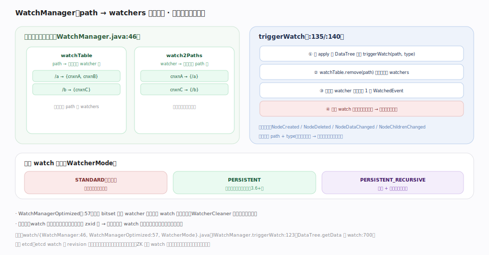

# ZooKeeper 原理 · 支撑主线 · Watch 机制

> **定位**：Watch 是 ZooKeeper 的**变更订阅机制**——让客户端在不轮询的前提下感知 znode 变化（对应 etcd 的 Watch，但 ZK 标准 watch 是一次性触发、事件不带数据）。它由 [[数据树 DataTree]] 的写在 apply 后触发、注册于 [[客户端 API 与 znode]] 的读操作、随 [[会话与临时节点]] 过期而清理。核实基准：`server/watch/{WatchManager,WatchManagerOptimized,WatcherMode,IWatchManager}.java`（3.10.0-SNAPSHOT）。

## 一、双向映射 + 一次性触发

服务端 `WatchManager`（`WatchManager.java:46`）维护两张互逆的映射：**watchTable**（`path → 该路径的 watcher 集`，触发时按 path 找 watchers）与 **watch2Paths**（`watcher → 它监听的 path 集`，连接断开时按此清理）。

触发链路（`triggerWatch` `:135`/`:140`；接口 `IWatchManager.triggerWatch:123`）：① 写事务 apply 到 DataTree 后调 `triggerWatch(path, type, zxid)` → ② 从 watchTable **取出并移除**该 path 的 watchers → ③ 给每个 watcher 的连接推送**恰好一个** `WatchedEvent`（只带 path + type，**不带新数据**）→ ④ 标准 watch 用完即弃。客户端收到事件后**自行重读**拿新值、并按需重新注册 watch。事件类型：`NodeCreated` / `NodeDeleted` / `NodeDataChanged` / `NodeChildrenChanged`。

## 二、三种 watch 模式

- **STANDARD（默认）**：一次性，触发即从 watchTable 移除。设计动机——避免服务端为海量长期订阅保持状态。
- **PERSISTENT（3.6+）**：持久，触发后仍有效，不需重挂。
- **PERSISTENT_RECURSIVE（3.6+）**：持久 + 递归，监听整棵子树的任意变更（`addWatch` 注册，`WatcherMode`）。

`WatchManagerOptimized`（`WatchManagerOptimized.java:57`）用 bitset 表示 watcher 集合，在海量 watch 时显著省内存；`WatcherCleaner` 后台清理死连接遗留的 watch。

## 深化 · 顺序保证：watch 与数据视图一致

Watch 事件与数据变更**同源于同一 zxid 全序**：客户端保证**先收到 watch 事件、再看到该事件之后写入的读结果**。这让"感知变化 → 重读拿新值"是安全的（不会出现"读到新值却漏了 watch"）。但注意标准 watch 一次性：从触发到重挂之间发生的变更会被漏掉（gap），需要监听连续变更时用 PERSISTENT watch 或在业务层用版本号兜底。

## 拓展 · watch 特性与对照

| 特性 | ZooKeeper（标准） | etcd |
|---|---|---|
| 触发次数 | 一次性（触发即失效） | 持续流 |
| 事件内容 | path + type，不带数据 | 带 KV 前后值 |
| 历史补发 | 无（重连需重挂） | 可从历史 revision 补发 |
| 订阅粒度 | 单节点 / 子列表 / 3.6+ 递归子树 | key / range / 前缀 |
| 服务端状态 | 触发即移除（省状态） | 维护订阅 + progress |
| 有序 | 与 zxid 序一致 | 与 revision 序一致 |

## 调优要点（关键开关）

- 优先用 PERSISTENT/RECURSIVE watch（3.6+）避免"重挂 gap"，或用 Curator 的 Cache recipe 封装重挂。
- 单路径挂海量 watcher 会放大触发推送；热点路径谨慎。
- `WatchManagerOptimized` 在超多 watch 时省内存（配置类切换）。
- 客户端会话恢复后必须重挂 watch（标准 watch 不随会话迁移自动恢复）。

## 常见误区与工程要点

- **以为 watch 持续通知**：标准 watch 触发一次即失效；不重挂就漏后续变更。
- **以为事件带新数据**：事件只有 path + type，必须重读拿值。
- **依赖 watch 做严格计数/审计**：一次性 + gap 决定它不适合"不丢任何一次变更"的场景；用 PERSISTENT 或版本轮询兜底。
- **watch 泄漏**：连接断了却没清理——WatchManager 的 watch2Paths + WatcherCleaner 负责，但业务重连时也要重挂。

## 一句话总纲

**Watch 是 ZooKeeper 的免轮询变更订阅：WatchManager 维护 watchTable（path→watchers）与 watch2Paths（watcher→paths）两张互逆映射，写事务 apply 到 DataTree 后 triggerWatch 按 path 取出并移除 watchers、给每个连接推恰好一个只带 path+type 的 WatchedEvent；标准 watch 一次性（触发即失效、事件不带数据，客户端需重读+重挂），3.6+ 补了 PERSISTENT/PERSISTENT_RECURSIVE 持久递归 watch。watch 与数据变更同源于 zxid 全序故"先收事件再见新值"一致——一次性语义换来服务端极省状态，但重挂间隙的变更会漏，连续监听要用持久 watch。与 etcd 的持续流+历史补发不同，这是 ZK 轻量协调的取舍。**
