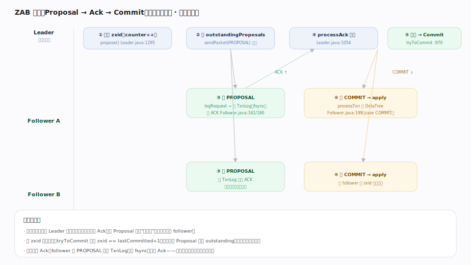
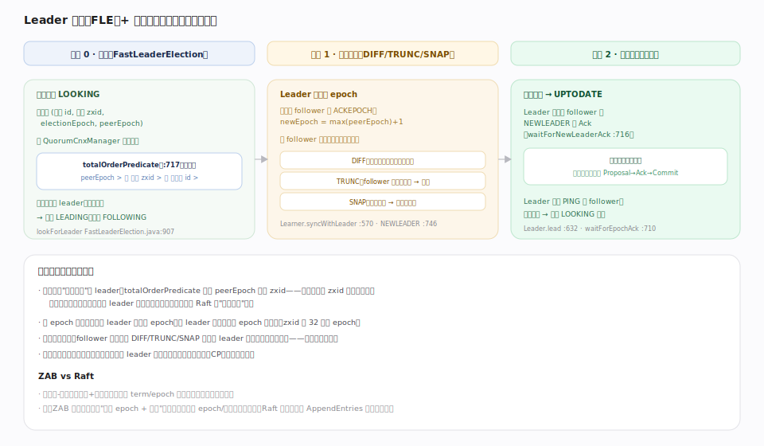
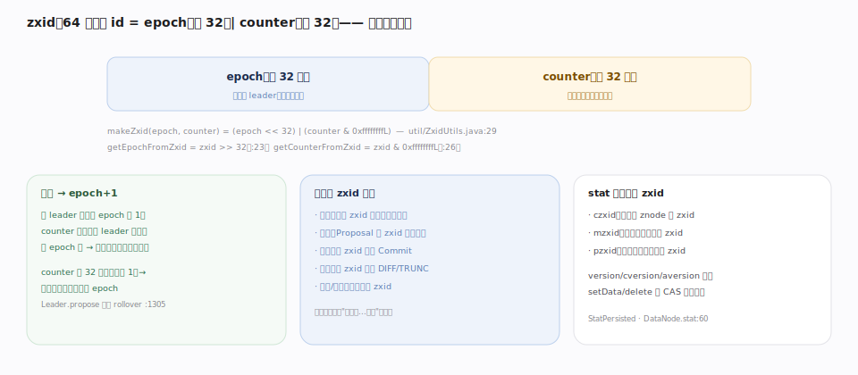

# ZooKeeper 原理 · 支撑主线 · ZAB 原子广播（灵魂）

> **定位**：ZAB（ZooKeeper Atomic Broadcast）是共识底座、ZooKeeper 的**灵魂主线**——把"单机内存树"变成"线性化写、全局有序的分布式协调服务"。骨架 = `唯一 Leader 发起 Proposal → 广播到过半 follower 落盘回 Ack → Commit → apply`。它是所有写路径的必经之地（见依赖矩阵：所有写都强依赖它），被 [[数据树 DataTree]] 承接 apply、被 [[事务日志与快照]] 持久化、被 [[请求处理链]] 在 `ProposalRequestProcessor` 触发、被 [[集群与 Quorum]] 用 `QuorumCnxManager` 承载选举通信。核实基准：`server/quorum/{Leader,Follower,Learner,LearnerHandler,FastLeaderElection,QuorumPeer}.java`、`util/ZxidUtils.java`（3.10.0-SNAPSHOT）。

## 一、广播：Proposal → Ack → Commit

正常服务期（broadcast 阶段），所有写都由**唯一 Leader** 定序广播，形如两阶段提交：

1. Leader 给请求分配 zxid（counter++），调 `propose(Request)`（`Leader.java:1295`）：构造 `QuorumPacket(PROPOSAL, zxid, data)`、存入 `outstandingProposals`、`sendPacket` 广播给所有 follower。
2. Follower 收 PROPOSAL（`Follower.java:161`）→ `logRequest` 先把事务写 **TxnLog**（可 fsync 落盘）再回 **ACK**（`:180`）——**先落盘后 Ack** 是"已提交不丢"的关键。
3. Leader 的 `processAck`（`Leader.java:1054`）计票，`tryToCommit`（`:970`）判定：该 Proposal 已被**过半**接受（`p.hasAllQuorums()`）**且** zxid == `lastCommitted+1`（保证按序）→ 广播 **COMMIT**、本地 `commit(zxid)` 并交 `commitProcessor.commit`。
4. 各 follower 收 COMMIT（`Follower.java:199`）→ `processTxn` apply 到 DataTree，触发 watch。

关键不变量：**过半即定**（不必等所有节点）、**按 zxid 顺序提交**（全序）、**先落盘再 Ack**（持久性）。

## 二、选举与恢复：从崩溃到重新广播

Leader 失联时集群进入 LOOKING，走三阶段回到服务：

- **阶段 0 · 选举（FastLeaderElection）**：各节点进入 LOOKING（`QuorumPeer.java` ServerState 枚举 `:578`；主循环 `case LOOKING` 调 `lookForLeader()` `:1566`），投票 `(id, zxid, electionEpoch, peerEpoch)`（`Vote.java:72-78`），经 `QuorumCnxManager` 交换。`totalOrderPredicate`（`FastLeaderElection.java:717`）比较：**先比 peerEpoch，同则比 zxid，再同则比 server id**——数据最新者当选。收敛到同一 leader 且过半认同后，胜者 LEADING、余者 FOLLOWING（`lookForLeader()` `:907`）。
- **阶段 1 · 恢复同步**：新 Leader 收集各 follower 的 `ACKEPOCH` 定出更高的新 epoch（`waitForEpochAck` `Leader.java:710`），然后按每个 follower 的落后程度选同步方式（`Learner.syncWithLeader` `:570`）：**DIFF**（只补差异事务，最常见）/ **TRUNC**（follower 有未提交的多余尾巴 → 截断）/ **SNAP**（落后太多 → 发整份快照）。
- **阶段 2 · 广播**：同步完成发 **UPTODATE**（`Learner.java:731`），Leader 等过半回 NEWLEADER 的 Ack（`waitForNewLeaderAck` `:716`）后正式对外服务，进入第一节的广播循环。此后 Leader 周期 PING follower，失联过半则退回 LOOKING 重选。

**为何一致**：选举选出"已提交事务 zxid 最大"的节点当 leader，保证任何已提交事务都在新 leader 上（不丢）；新 epoch 使旧 leader 的低 epoch 包被拒（防脑裂）；follower 先对齐历史再服务。

## 三、zxid：一切顺序的锚

64 位事务 id 分两段（`util/ZxidUtils.java`）：**epoch（高 32，第几任 leader）| counter（低 32，任内递增）**——`makeZxid = (epoch<<32) | (counter & 0xffffffffL)`（`:29`）。换主时 epoch+1、counter 归零，旧 leader 复活发的低 epoch 包被直接拒（防脑裂）。counter 耗尽（低 32 位全 1）会强制重新选举进入新 epoch（`Leader.propose` 里检测 rollover）。选举比 zxid、广播按 zxid 递增、提交按 zxid 顺序、恢复按 zxid 决定 DIFF/TRUNC、快照/日志文件名带 zxid——**一个数字统一了全序**。znode 的 stat 里还有 czxid/mzxid/pzxid 记录各类修改的 zxid。

## 深化 · ZAB 与 Raft 对照

| 维度 | **ZAB（ZooKeeper）** | Raft（etcd） |
|---|---|---|
| 角色 | Leader / Follower / Observer | Leader / Follower / Candidate / Learner |
| 纪元 | epoch（zxid 高 32 位） | term |
| 选举依据 | 比 (peerEpoch, zxid, id) 选数据最新 | 比 (term, lastLogIndex) + 多数投票 |
| 恢复 | **独立发现+同步阶段**（DIFF/TRUNC/SNAP）后才广播 | 融进 AppendEntries 一致性检查、逐步回退对齐 |
| 提交条件 | 过半 Ack 且按 zxid 顺序 | 过半 matchIndex 且当前 term 有条目 |
| 日志语义 | 事务（幂等 processTxn） | 状态机命令 |
| 每 follower 通道 | LearnerHandler 一线程 | 逐 peer 的复制流 |

## 拓展 · ZAB 关键组件与锚点

| 组件 | 职责 | 核实锚点 |
|---|---|---|
| Leader | 定序、propose、计票、commit | `Leader.java`：lead():632、propose():1295、processAck():1054、tryToCommit():970 |
| LearnerHandler | Leader 侧每 follower 一个处理线程 | `LearnerHandler.java`（1183 行） |
| Follower | 收 PROPOSAL/COMMIT、回 Ack | `Follower.java`：followLeader():71、processPacket():156 |
| FastLeaderElection | LOOKING 期投票选主 | `FastLeaderElection.java`：lookForLeader():907、totalOrderPredicate():717 |
| 包类型常量 | PROPOSAL=2/ACK=3/COMMIT=4/DIFF=13/SNAP=15/UPTODATE=12… | `Leader.java`:382-470 |

## 调优要点（关键开关）

- `tickTime`（默认 2000ms）：ZAB 心跳与超时的基本单位；选举/会话超时都是它的倍数。
- `initLimit`：follower 初始连接 + 同步 leader 允许的 tick 数（大数据集/慢盘需调大，否则 SNAP 同步超时）。
- `syncLimit`：follower 与 leader 间发送/响应允许的 tick 数（网络抖动误判失联则调大）。
- `zookeeper.forceSync`（默认 yes）：follower Ack 前是否 fsync——关掉提速但牺牲持久性，生产勿关。
- `electionAlg`（默认 3 = FLE）：其它选举算法已废弃，保持 FLE。

## 常见误区与工程要点

- **以为多个节点能并发写**：写只经唯一 Leader 定序广播；follower 收到写请求会转发给 leader。吞吐上限是单 leader。
- **以为 follower Ack 前不落盘**：默认先写 TxnLog（forceSync）再 Ack；关 forceSync 会让"已提交"在崩溃后可能丢，破坏持久性。
- **把 ZAB 当 Raft 讲**：二者同族但恢复流程不同——ZAB 有独立的发现 epoch + 同步（DIFF/TRUNC/SNAP）阶段。
- **偶数节点**：不增容错反增开销；用奇数。过半不可用时集群停写（CP，宁停不错）。

## 一句话总纲

**ZAB 是 ZooKeeper 的灵魂共识层：唯一 Leader 给每个写分配全序 zxid（epoch<<32|counter），构造 Proposal 广播到所有 follower、follower 先落 TxnLog（fsync）再回 Ack、Leader 收齐过半 Ack 后按 zxid 顺序 Commit 并 apply 到 DataTree——过半即定、按序提交、先盘后 Ack 三不变量保证线性化写与持久性；Leader 崩溃则经 FastLeaderElection 比 (peerEpoch,zxid,id) 选出数据最新者当选、用更高 epoch 防脑裂、经 DIFF/TRUNC/SNAP 同步补齐 follower 历史后重回广播。它与 Raft 同为主-从日志复制共识，差异在独立的发现+同步恢复阶段——这是 ZooKeeper 一切写路径与顺序保证的根。**
