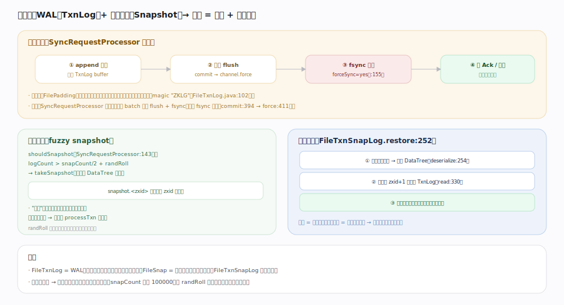

# ZooKeeper 原理 · 支撑主线 · 事务日志与快照

> **定位**：事务日志与快照是 ZooKeeper 的**持久化与崩溃恢复层**——用 WAL + 周期快照把内存 DataTree 的状态落到磁盘（对应 etcd 的 WAL + snapshot）。它承接 [[请求处理链]] 中 `SyncRequestProcessor` 的落盘、持久化 [[ZAB 原子广播]] 提交的事务、在重启时重建 [[数据树 DataTree]]。核实基准：`server/persistence/{FileTxnLog,FileSnap,FileTxnSnapLog,FilePadding}.java`、`server/SyncRequestProcessor.java`（3.10.0-SNAPSHOT）。

## 一、落盘与恢复

**写盘路径**（由 `SyncRequestProcessor` 驱动）：① 事务 `append` 到 TxnLog 缓冲 → ② 批量 `flush`（`SyncRequestProcessor.java` `toFlush` 队列 → `ZKDatabase.commit` `:235`）→ ③ **fsync 落盘**（`FileTxnLog.commit:394` → `channel.force(false):411`；`forceSync` 默认 yes `:155`）→ ④ 才回 Ack / 返回。批量攒多条事务一次 fsync，降低 fsync 次数。日志文件用 `FilePadding` **预分配**到固定大小（减少文件扩展的元数据写），文件头有 magic `"ZKLG"`（`FileTxnLog.java:102`）。

**周期快照（fuzzy snapshot）**：`SyncRequestProcessor.shouldSnapshot`（`:143`）判定 `logCount > snapCount/2 + randRoll`（`randRoll` 随机化 `:151`）时 `takeSnapshot`（`:193`）把整棵 DataTree 序列化成 `snapshot.<zxid>`。**"模糊"**指快照期间不停写，快照内可能含部分"未来"事务——靠 `processTxn` 幂等在恢复时修正。`randRoll` 打散各节点快照时刻，避免全集群同时卡顿。

**重启恢复**（`FileTxnSnapLog.restore:252`）：① 加载最新快照重建 DataTree（`snapLog.deserialize:254`）→ ② 从快照 zxid+1 起回放 TxnLog（`txnLog.read:330`）→ ③ 得到崩溃前最新状态。快照是全量存档、日志是增量，二者合起来无损恢复；幂等重放保证正确。

## 深化 · 为什么 WAL + 快照而非只用其一

| 方案 | 问题 | ZK 的选择 |
|---|---|---|
| 只写日志 | 恢复要从头回放全部历史，越跑越慢 | ❌ |
| 只存快照 | 每次写都全量落盘，代价爆炸；两次快照间崩溃丢数据 | ❌ |
| WAL + 周期快照 | 日志保"最近增量不丢"、快照保"不用从头回放" | ✅ 恢复 = 最新快照 + 增量日志 |

`FileTxnSnapLog`（`:52`）是二者的统管门面（`txnLog` `:169`、`snapLog` `:170`）；`save` 写快照，`restore` 加载 + 回放。

## 拓展 · 组件与锚点

| 组件 | 职责 | 锚点 |
|---|---|---|
| FileTxnLog | 事务日志（WAL）：append/commit/fsync/预分配 | `FileTxnLog.java`：magic:102、commit:394、force:411 |
| FileSnap | 快照读写（序列化/反序列化 DataTree） | `FileSnap.java` |
| FileTxnSnapLog | 统管日志 + 快照；restore 恢复 | `FileTxnSnapLog.java`：52、restore:252 |
| FilePadding | 日志文件预分配 | `FilePadding.java` |
| SyncRequestProcessor | 驱动落盘 + 触发快照 | `SyncRequestProcessor.java`：shouldSnapshot:143 |

## 调优要点（关键开关）

- `dataDir` / `dataLogDir`：把**事务日志单独放到独立快速磁盘**（与快照分盘）——fsync 延迟是 ZK 写性能头号因素。
- `snapCount`（默认 100000）：多少事务触发一次快照——调大减少快照频率但增重启回放量。
- `zookeeper.forceSync`（默认 yes）：Ack 前是否 fsync——关掉提速但牺牲持久性，生产勿关。
- `autopurge.snapRetainCount` / `autopurge.purgeInterval`：自动清理旧快照与日志，防磁盘涨满。
- `fsync.warningthresholdms`（默认 1000）：fsync 超此毫秒告警——磁盘慢的哨兵（`FileTxnLog.java:135`）。

## 常见误区与工程要点

- **日志与快照同盘**：fsync 与快照 IO 争抢，写延迟飙升；务必 `dataLogDir` 独立盘。
- **关 forceSync 图快**：崩溃后"已提交"可能丢，破坏持久性与一致性。
- **不配 autopurge**：日志/快照无限增长撑爆磁盘 → 集群不可用。
- **snapCount 太小**：快照过频，运行时抖动；太大则重启回放久。
- **以为快照是精确时点**：fuzzy 快照含跨界事务，靠幂等重放修正——不能当"某 zxid 的精确镜像"直接用。

## 一句话总纲

**事务日志与快照是 ZooKeeper 的持久化与恢复层：SyncRequestProcessor 把 ZAB 提交的事务批量 append 到 WAL（FileTxnLog，预分配 + magic ZKLG）、flush 时 channel.force 做 fsync（forceSync 默认 yes）才回 Ack 保证已提交不丢；并按 logCount>snapCount/2+randRoll 周期 takeSnapshot 把整棵 DataTree 序列化成 snapshot.<zxid>（模糊快照，靠幂等 processTxn 修正跨界事务，randRoll 打散各节点时刻）。重启时 FileTxnSnapLog.restore 先加载最新快照重建树、再从快照 zxid+1 回放日志——快照免从头回放、日志保最近增量，合起来无损恢复。运维要害是把事务日志放独立快盘（fsync 延迟决定写性能）、配 autopurge 防磁盘涨满。**
