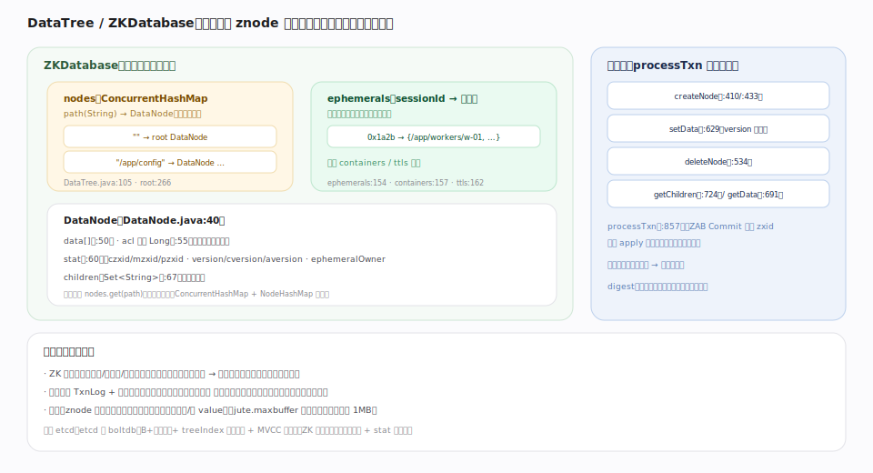

# ZooKeeper 原理 · 支撑主线 · 数据树 DataTree

> **定位**：DataTree 是 ZooKeeper 的**存储/数据核心**——全量常驻内存的层级 znode 树，读写都在此发生（对应 etcd 的 MVCC store，但 ZK 是纯内存树、仅存最新值）。它承接 [[ZAB 原子广播]] Commit 后的 `processTxn` apply、为 [[客户端 API 与 znode]] 的读直接服务、按 sessionId 索引供 [[会话与临时节点]] 回收临时节点、其状态由 [[事务日志与快照]] 持久化恢复。核实基准：`server/DataTree.java`、`DataNode.java`、`ZKDatabase.java`（3.10.0-SNAPSHOT）。

## 一、结构：nodes 映射 + DataNode + 索引

`ZKDatabase` 是内存数据库门面，核心是 `DataTree`（`DataTree.java:95`）。数据结构：

- **nodes**（`:105`）：`path(String) → DataNode` 的并发哈希映射，提供 O(1) 路径定位。根是 `root DataNode`（`:266`，以 `""` 为 key）。虽然逻辑上是树，但用 map 存全部节点、靠 DataNode 里的 `children` 维系父子。
- **DataNode**（`DataNode.java:40`）：一个 znode 的载体——`data[]`（`:50`）、`acl` 引用（`:55`，`Long` 指向共享 ACL 表以去重）、`stat`（`:60`，含 czxid/mzxid/pzxid、各类 version、`ephemeralOwner`）、`children`（`:67`，子节点名集合）。
- **ephemerals**（`:154`）：`sessionId → 该会话创建的临时节点路径集`——会话结束时据此批量删除。另有 `containers`（`:157`）与 `ttls`（`:162`）集合供后台回收。

## 二、读写：读直查、写幂等 apply

读（`getData` `:691`、`getChildren` `:724`）直接 `nodes.get(path)` 返回，不加写锁、不查磁盘——这是"读吞吐可随节点扩展"的物理基础。写不直接改树，而是经 ZAB Commit 后由 `processTxn`（`:857`）**按 zxid 顺序、幂等地** apply：`createNode`（`:410`/`:433`）、`setData`（`:629`，version 自增）、`deleteNode`（`:534`）。幂等 + 全序保证任何节点重放同一段事务日志都得到相同的树——这是快照/日志恢复正确的前提。

## 深化 · 与 etcd 存储的对照

| 维度 | **ZooKeeper DataTree** | etcd MVCC |
|---|---|---|
| 形态 | 纯内存层级树（map + children） | boltdb（B+树落盘）+ treeIndex 内存索引 |
| 版本 | 仅最新值 + stat 里的 version 号 | 多版本，可按 revision 读历史 |
| 读 | 直查内存、无磁盘 IO | 走 backend 事务（有缓存） |
| 数据量 | 受内存约束（存小元数据） | 受磁盘配额约束（默认 2GB） |
| 一致性单元 | znode（路径 + 数据 + 子） | key（扁平） |
| 层级 | 天然层级/父子/顺序号 | 靠 key 前缀模拟 |

## 拓展 · stat 各字段

| 字段 | 含义 |
|---|---|
| czxid / mzxid / pzxid | 创建 / 数据最后修改 / 子列表最后修改 的 zxid |
| ctime / mtime | 创建 / 修改 时间戳 |
| version / cversion / aversion | 数据 / 子节点 / ACL 的版本号（CAS 用） |
| ephemeralOwner | 临时节点=拥有者 sessionId，持久节点=0 |
| dataLength / numChildren | 数据字节数 / 子节点数 |

## 调优要点（关键开关）

- `jute.maxbuffer`（默认约 1MB）：单节点数据 + 单请求上限——ZK 存小数据，大 value 撑大内存与日志。
- znode 总数与总数据量受堆内存约束；监控 JVM 堆与 `approximate_data_size`。
- `zookeeper.digest.enabled`：开启数据树摘要校验，检测副本间不一致（略增开销）。
- 大量子节点的父路径 `getChildren` 会返回大列表——避免单父下堆放海量子节点。

## 常见误区与工程要点

- **把 ZK 当 KV 数据库存大数据**：全量内存树，海量/大 value 会 OOM、拖慢快照与恢复。
- **以为能读历史版本**：ZK 只存最新值 + version 号，无 MVCC 时间旅行；version 只用于 CAS。
- **以为写直接改树**：写必经 ZAB，Commit 后才 processTxn apply；未提交不可见。
- **在临时节点下建子**：ephemeral 不能有子节点。

## 一句话总纲

**DataTree 是 ZooKeeper 的全量内存 znode 树：以 path→DataNode 的并发映射存储整棵树、DataNode 含 data/acl 引用/stat（各类 zxid 与 version）/children，并按 sessionId 维护 ephemerals 索引供会话回收；读直接查内存无磁盘 IO 故可扩展，写不直接改树而经 ZAB Commit 后由 processTxn 按 zxid 顺序幂等 apply（createNode/setData/deleteNode），幂等+全序保证重放日志得同一棵树。它只存最新值+version 号（非 MVCC 多版本）、只放小元数据（受内存约束）——磁盘上的日志与快照仅用于恢复，不在读写关键路径。**
