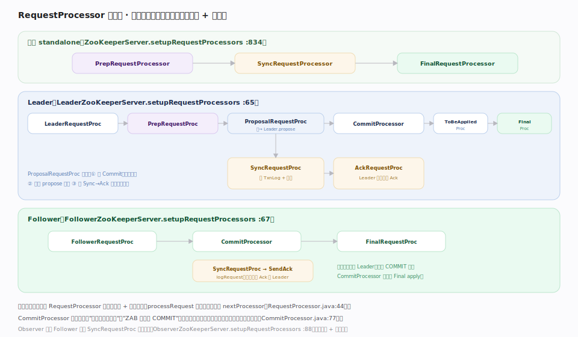

# ZooKeeper 原理 · 支撑主线 · 请求处理链

> **定位**：请求处理链是 ZooKeeper 的**执行骨架**——把一个请求从入站到落库的处理拆成一串 `RequestProcessor`（责任链），不同角色（单机/Leader/Follower/Observer）拼出不同的链。它衔接 [[客户端 API 与 znode]]（入口）、[[ZAB 原子广播]]（写在 `ProposalRequestProcessor` 触发 propose）、[[事务日志与快照]]（`SyncRequestProcessor` 落盘）、[[数据树 DataTree]]（`FinalRequestProcessor` apply）。核实基准：`server/{PrepRequestProcessor,SyncRequestProcessor,FinalRequestProcessor,RequestProcessor}.java`、`server/quorum/{CommitProcessor,ProposalRequestProcessor,AckRequestProcessor}.java`、各 `*ZooKeeperServer.setupRequestProcessors`（3.10.0-SNAPSHOT）。

## 一、三种拓扑：同一批处理器，不同拼法

`RequestProcessor` 是责任链接口（`processRequest` `RequestProcessor.java:44`），每个实现有独立线程 + 输入队列，处理完把请求交 `nextProcessor`。角色不同，链的拼法不同：

- **单机 standalone**（`ZooKeeperServer.java:834`）：`PrepRequestProcessor`（`:838`）→ `SyncRequestProcessor`（`:836`）→ `FinalRequestProcessor`（`:835`）。无共识，写直接落盘 + apply。
- **Leader**（`LeaderZooKeeperServer.java:65`）：`LeaderRequestProcessor` → `PrepRequestProcessor` → `ProposalRequestProcessor` → `CommitProcessor` → `ToBeAppliedRequestProcessor` → `FinalRequestProcessor`；`ProposalRequestProcessor` 内部还分叉出 `SyncRequestProcessor → AckRequestProcessor`（`ProposalRequestProcessor.java:52-53`），让 leader 自己也落盘并给自己记一票。
- **Follower**（`FollowerZooKeeperServer.java:67`）：`FollowerRequestProcessor` → `CommitProcessor` → `FinalRequestProcessor`；另有独立的 `SyncRequestProcessor → SendAckRequestProcessor`，由 `logRequest` 驱动（收 PROPOSAL 后落盘并回 Ack 给 leader）。
- **Observer**（`ObserverZooKeeperServer.java:88`）：类似 Follower 但不参与投票，只同步 + 服务读。

## 二、各处理器职责

各处理器分工（配合总架构图第二节的贯穿示例）：

- **PrepRequestProcessor**：请求预处理——校验路径/版本、`checkACL`（`PrepRequestProcessor.java` 各 case，如 create→CREATE `:664`、setData→WRITE `:383`）、把写请求转成幂等**事务**（记录变更前的 ChangeRecord，供后续处理器和回滚用）。
- **ProposalRequestProcessor**（仅 Leader）：`processRequest`（`:68`）先把请求转 `nextProcessor`（=CommitProcessor，等提交，`:80`），若是写则调 `zks.getLeader().propose`（`:85`）广播，并交内嵌 `syncProcessor` 落盘计票（`:89`）。
- **SyncRequestProcessor**：把事务批量写 TxnLog（`flush` → `ZKDatabase.commit` `:235`），并周期触发快照（`shouldSnapshot` `:143`）——详见 [[事务日志与快照]]。
- **CommitProcessor**（`CommitProcessor.java:77`）：双队列——`queuedRequests`（本地已排的请求 `:93`）与 `committedRequests`（ZAB 送回的 COMMIT `:114`）。它把两者对齐，保证写按全序放行、读看到已提交状态，是"本地顺序 ↔ 全局提交顺序"的汇合点。
- **FinalRequestProcessor**：链尾——把已提交事务 `processTxn` apply 到 DataTree、组织响应、触发 watch、处理读请求（`case OpCode.getData/getChildren/addWatch` `FinalRequestProcessor.java:437`）。

## 深化 · 为什么要拆成链

| 收益 | 说明 |
|---|---|
| 关注点分离 | 校验/共识/落盘/应用各司其职，一个环节改动不牵动其它 |
| 流水线并发 | 每处理器独立线程 + 队列，请求像流水线推进，吞吐更高 |
| 角色可组合 | 同一批处理器换拼法即支持单机/Leader/Follower/Observer |
| 读写分道 | 读在 Final 直接查内存树返回；写在 Proposal 分叉进 ZAB |
| 顺序汇合 | CommitProcessor 专门对齐"本地排序"与"ZAB 提交序" |

## 拓展 · 处理器与锚点

| 处理器 | 角色 | 核实锚点 |
|---|---|---|
| PrepRequestProcessor | 全部 | `PrepRequestProcessor.java:91`（含 checkACL 多处） |
| ProposalRequestProcessor | Leader | `ProposalRequestProcessor.java:68/85` |
| SyncRequestProcessor | Leader/Follower/单机 | `SyncRequestProcessor.java`（shouldSnapshot:143） |
| CommitProcessor | Leader/Follower | `CommitProcessor.java:77`（run:197） |
| FinalRequestProcessor | 全部 | `FinalRequestProcessor.java`（712 行） |
| AckRequestProcessor | Leader（自 Ack） | `ProposalRequestProcessor.java:52` |
| SendAckRequestProcessor | Follower（回 Ack） | `FollowerZooKeeperServer.java:74` |

## 调优要点（关键开关）

- `zookeeper.commitProcessor.numWorkerThreads`：CommitProcessor 处理读的线程池大小——读密集可调大。
- `zookeeper.commitProcessor.maxReadBatchSize` / `maxCommitBatchSize`：批量读/提交上限，平衡读放行与写提交的公平性。
- `zookeeper.maxBatchSize`：SyncRequestProcessor 落盘批大小——大批降 fsync 频率但增延迟。
- 链的线程都是长驻，观测各队列积压（metrics）定位瓶颈处理器。

## 常见误区与工程要点

- **以为读也走完整链**：读在 Final 直接查内存树返回，不 propose、不落盘。
- **以为 CommitProcessor 可有可无**：它是并发下"顺序正确性"的关键——去掉会让读看到未提交或写乱序。
- **混淆 Leader 的两条 sync 分支**：主链的 propose 广播，与 ProposalRequestProcessor 内嵌的 Sync→Ack（leader 自己落盘+自投票）是两回事。
- **单机链当集群讲**：单机无 Proposal/Commit/Ack，写直接 Sync→Final。

## 一句话总纲

**请求处理链是 ZooKeeper 的执行骨架：把处理拆成一串各有独立线程+队列的 RequestProcessor 责任链，同一批处理器按角色拼出不同拓扑——单机是 Prep→Sync→Final，Leader 是 LeaderReq→Prep→Proposal→Commit→ToBeApplied→Final（Proposal 分叉出 Sync→Ack 让主自己落盘计票），Follower 是 FollowerReq→Commit→Final（旁路 Sync→SendAck 回 Ack）；Prep 校验+ACL+建幂等事务、Proposal 触发 ZAB 广播、Sync 落 TxnLog 与快照、CommitProcessor 对齐本地序与 ZAB 提交序、Final apply 到 DataTree 并触发 watch。读在 Final 直查内存树、写分道进共识——流水线式责任链兼得关注点分离、并发吞吐与顺序正确。**
